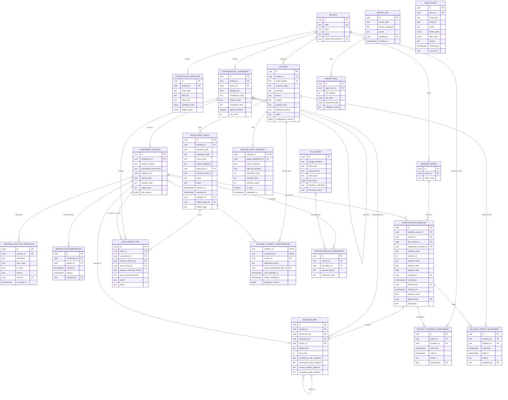
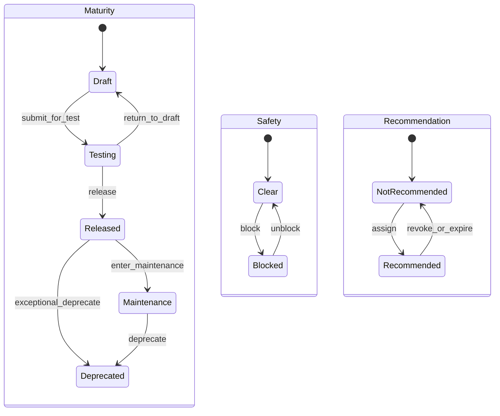
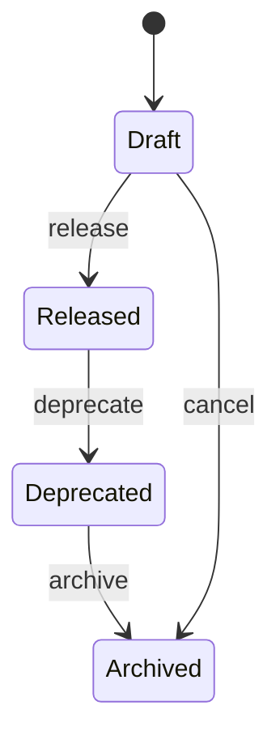

# Software Configuration & Machine Version Management System

## Final Architecture and Product Plan

**Status:** Approved architecture baseline before Core V1 coding  
**Deployment:** Pure Windows  
**Delivery approach:** Vertical Slice Incremental Development  
**Primary language:** Chinese UI and documentation, English code identifiers

---

# 0. Executive Summary

本系统是面向工程团队的本地部署、局域网多用户软件配置管理与机台版本追溯系统。它不是 Git Repository、软件包下载站、普通资产管理系统或通用 CRUD 后台。

系统管理的主链路是：

```text
Project
  → ConfigurationComponent
    → ComponentVersion
      → Version Lifecycle
        → ConfigurationBaseline
          → Project Current Standard
          → Machine Target Baseline
            → Deployment / Observation History
              → Machine Actual Configuration
                → Drift / Risk / Compare / Traceability
```

最终架构采用：

- React + TypeScript + Vite + Ant Design + TanStack Query。
- ASP.NET Core / .NET 10。
- EF Core + Npgsql。
- PostgreSQL 18 Native Windows Service（计划生产目标；当前实际验证运行时为 PostgreSQL 17，正式目标版本与 Windows Service 验收仍待完成）。
- Modular Monolith。
- Single Database、Single Server First。
- IIS 托管单一 ASP.NET Core Application。
- React Build 由 ASP.NET Core `wwwroot` 提供。
- Background Worker 作为 Windows Service。
- Local NTFS + External UNC/SMB File Store。
- Windows Task Scheduler + PowerShell + `pg_dump` 备份。

生产环境明确不依赖：

- Linux。
- Hyper-V Linux VM。
- WSL。
- Docker / Docker Compose。
- Nginx。
- Kubernetes。
- Redis、Kafka、RabbitMQ、Elasticsearch。

---

# A. Domain Analysis

## A1. 四个必须严格区分的概念

### Target vs Actual

- Project Current Standard：项目当前推荐的标准 Baseline。
- Machine Target Baseline：某台机台当前应该达到的精确 Baseline Revision。
- Machine Actual Configuration：通过有效 Deployment/Observation Facts 得到的实际配置。
- Configuration Drift 必须比较 Machine Target 与 Machine Actual。
- Machine Target 落后于 Project Current Standard 不自动构成 Drift。

### Baseline vs Version

- ComponentVersion 是单个 Component 的版本身份。
- ConfigurationBaseline 是多个 ComponentVersion 构成的完整标准配置快照。
- Top Software Version 只是 Baseline 的锚点，不等同于 Baseline。
- 同一 Top Software Version 允许对应多个 Baseline，关系为 1:N。

### Match vs Risk

- Match 回答实际配置是否等于目标配置。
- Risk 回答当前配置是否安全、受支持或合规。
- `Expected = Installed` 可以得到 `Matched + Critical`，例如该 Version 后续被 Blocked。
- Match Status 与 Risk Severity 不得合并为同一字段。

### Version Lifecycle vs Baseline Lifecycle

- Version Lifecycle 描述单个 Version 的成熟度、安全状态和推荐关系。
- Baseline Lifecycle 描述配置快照的编制、发布、废弃和归档。
- Version 后续 Blocked 不修改历史 Baseline 内容或 Lifecycle，只产生动态 Risk。
- 两套状态使用不同字段、历史记录、命令和权限。

## A2. 核心不变量

1. Released Baseline 的 Identity、Top Version、Items、树结构和 Requirement 不可修改。
2. Baseline 配套变化必须创建新的独立 Revision。
3. Version Number 是 opaque string，不解析或假设 SemVer。
4. ComponentVersion 使用显式 `sequence_no` 表达工程顺序，不从 Version Number 推导。
5. Recommendation/Upgrade 逻辑不能只依赖 Version Number 或 `sequence_no`。
6. 每台 Machine 任意时间最多有一个有效 Target Assignment。
7. Project Standard 与 Machine Target 都使用 Assignment History，不保存 Current Pointer。
8. Deployment/Observation History 是 Actual Configuration 的事实来源。
9. `MachineCurrentConfiguration` 是可重建 Current Projection。
10. 只有 Finalized 且成功的 Facts 才能更新 Current Projection。
11. Rollback、Correction 不覆盖原历史，而是新增事实。
12. Block Version 不自动修改 Machine Actual、Baseline 或 Deployment History。
13. Lifecycle Transition、Baseline Release、Target Change、Deployment、Import 必须审计。
14. 核心历史数据原则上不物理删除。
15. 文件内容不保存在数据库 BLOB；数据库保存 Metadata、Locator 和 Checksum。
16. 只有已证明来源覆盖完整、且所有 Component 身份与结果均已解析成功的 FULL Fact 才能生成 `ABSENT`；任何未解析、失败或跳过的行都不能被当作“不存在”。
17. Observation 不得覆盖同一安装实例已知的安装时间；安装时间未知时必须保持 Unknown，而不是用 Observation Time 填充。

## A3. 关键架构问题结论

| Topic | Final Decision |
|---|---|
| Component 抽象 | 使用适度通用 `ConfigurationComponent + ComponentVersion`，不建设万能 CMDB/EAV |
| Version 排序 | `version_number` opaque；同 Component 内使用显式唯一 `sequence_no` |
| Current Actual | History 为事实源，`MachineCurrentConfiguration` 为可重建投影 |
| Baseline Revision | 每个 Revision 是独立 Baseline，使用 `BaselineSeries` 分组 |
| Top Version | Top Version 与 Baseline 为 1:N |
| Machine Target | Assignment History + `valid_to IS NULL`，不保存 Current Pointer |
| Project Standard | Assignment History + `valid_to IS NULL`，不保存 Current Pointer |
| Deployment | `DeploymentBatch + DeploymentItem` |
| Observation | 复用统一事实结构，但用 `operation_type` 明确区分 |
| Temporal Model | Baseline Snapshot + Assignment Interval + Fact History + Current Projection |
| Component Tree | Adjacency List + Recursive CTE；Core V1 不使用 Closure Table |
| Recommended | 独立 Recommendation Assignment，不是 Maturity Enum |
| Blocked | 独立 Safety State，不是 Maturity Enum |
| Blocked Risk | Core V1 动态查询；Exposure Snapshot 延后 |
| Project Clone | 只复制模板型数据，不复制 Version、Baseline、Machine 或运行历史 |
| File Storage | NTFS/UNC 保存文件；PostgreSQL 保存 Metadata/Locator/Checksum |

---

# B. Bounded Modules

系统采用 Modular Monolith。模块共享一个 PostgreSQL Database，但业务写入必须通过模块 Application Service/Command，不能随意跨模块更新表。

| Module | Responsibility |
|---|---|
| Identity & Access | Local User、Cookie Authentication、RBAC |
| Project Management | Project、Project Role、Custom Field、Clone |
| Configuration Catalog | Component Tree、Version、Package Reference |
| Version Lifecycle | Maturity、Safety、Recommendation、Transition History |
| Baseline Management | Series、Revision、Items、Release、Project Standard |
| Machine Registry | Machine Metadata、Attachment、Target History |
| Deployment Management | Batch、Items、Observation、Partial Result |
| Configuration State | Current Actual、Historical As-of Reconstruction |
| Drift & Risk | Match、Risk、Machine Summary |
| Compare | Baseline/Machine Snapshot Resolution 和 Tree Diff |
| Traceability & Impact | 双向追溯、Version Real-time Impact |
| Search | Project/Component/Version/Baseline/Machine Global Search |
| Import | Excel/CSV Staging、Validation、Dry Run、Commit |
| Attachment | File Object、NTFS/UNC Storage、Checksum |
| Audit | Append-only Audit Trail |
| Background Processing | Import、Projection Refresh、Background Jobs |

---

# C. Recommended Domain Model

## C1. Aggregate Roots

### Project

- Project Identity 和状态。
- Project Metadata 与 Custom Field Definition。
- Component Structure。
- Project Standard Assignment History。
- Clone Source。

### ConfigurationComponent

- Project-scoped 配置槽位。
- 任意深度 Parent/Child。
- Component Kind。
- Stable Lineage Key。
- Required Default 和 Sort Order。

### ComponentVersion

- Opaque Version Number。
- Explicit Sequence Number。
- Release Metadata。
- Current Maturity/Safety。
- Recommendation Assignments。
- Lifecycle History。
- Package References。

### ConfigurationBaseline

- Baseline Series。
- Independent Revision。
- Top Version。
- Complete Baseline Item Tree。
- Lifecycle、Effective Date 和 Release Metadata。
- Released 后内容不可修改。

### Machine

- Machine Identity 和工程元数据。
- Target Assignment History。
- Deployment/Observation History。
- Current Actual Projection。
- Current Drift Summary。

### DeploymentBatch

- 一台 Machine 的一组事实。
- 明确 Operation Type 与 Source Type。
- 多个 DeploymentItem。
- Result、Effective Time、Recorded Time、Operator。

### ImportJob

- Source File、Adapter、Staging Rows、Issues、Conflict Resolution、Commit Result。

## C2. Value Objects

- `VersionNumber`：不透明字符串。
- `VersionSequence`：同 Component 内显式正整数顺序。
- `ComponentLineageKey`：Clone 后跨 Project 识别逻辑组件槽位。
- `Checksum`：Algorithm + Value。
- `TimeInterval`：`[valid_from, valid_to)`。
- `ConfigurationSnapshot`：Compare Engine 统一输入。
- `MatchResult`：Matched/Mismatch/Missing/Extra/Unknown。
- `RiskFinding`：Code + Severity + Source + Message。
- `StorageLocator`：Managed Object Key 或外部 UNC/URI。

---

# D. Core V1 ER Diagram



该图是 Core V1 主业务关系的简化 ER。以下 Supporting Tables 为避免主图过度拥挤而省略，但仍属于 Core V1 Schema：

- `baseline_lifecycle_transitions`
- `project_role_assignments`
- `project_custom_field_values`
- `import_issues`
- `version_attachments`
- `machine_attachments`
- `background_jobs`
- `idempotency_records`
- ASP.NET Core Identity tables

这些表在 Database Schema 和 Migration 中必须存在；“omitted from simplified ER”不代表延后实现。

---

# E. Core Database Schema

## E1. Project and Catalog

| Table | Purpose | Important Constraints / Indexes |
|---|---|---|
| `projects` | Project Identity | `UNIQUE(lower(code))`; status index |
| `project_role_assignments` | 项目关键角色 | Unique project+role+user |
| `custom_field_definitions` | Custom Field Schema | Unique project+entity_type+field_key |
| `project_custom_field_values` | Project Custom Values | PK project+definition；value JSONB |
| `configuration_components` | Adjacency Component Tree | Unique project+component_code；unique project+lineage_key；index project+parent+sort |
| `component_versions` | Version Identity/Current State | Unique component+normalized version；unique component+sequence_no |
| `version_lifecycle_transitions` | Maturity/Safety History | Index version+occurred_at DESC |
| `version_recommendations` | Basic Project+Component Recommendation | Unique active recommendation per component |
| `version_package_references` | Package Locator/Checksum | Index version；checksum |

`component_versions.sequence_no`：

```text
BIGINT NOT NULL
CHECK sequence_no > 0
UNIQUE(component_id, sequence_no)
```

默认 Version List：

```text
ORDER BY sequence_no DESC,
         release_date DESC NULLS LAST,
         created_at DESC
```

不从 `version_number` 自动生成 Sequence。Sequence 可以经权限控制后调整，但必须 Audit。

Project Clone 不复制 ComponentVersion，因此不会复制或跨 Project 继承 `sequence_no`。新 Project 中后续创建的 Version 使用该 Project 自己的 Component Version Sequence。

## E2. Baseline

| Table | Purpose | Important Constraints / Indexes |
|---|---|---|
| `baseline_series` | Revision Group | Unique project+series_code |
| `configuration_baselines` | Independent Revision | Unique project+baseline_code；unique series+revision_no；index top_version |
| `baseline_items` | Complete Config Tree | Unique baseline+component；index version+baseline；index baseline+parent+sort |
| `baseline_lifecycle_transitions` | Baseline State History | Index baseline+occurred_at DESC |
| `project_standard_assignments` | Standard History | `assigned_by` required；unique current project；GiST exclusion prevents overlap |

`configuration_baselines` 至少包含：

```text
created_by
created_at
released_by nullable while Draft
released_at nullable while Draft
release_reason nullable while Draft
approved_by nullable
description
```

进入 Released 时 `released_by`、`released_at`、`release_reason` 必填；`approved_by` 在 Core V1 保持可空。

数据库约束或 Trigger 必须拒绝对 Released/Deprecated/Archived Baseline Items 执行 Update/Delete。

## E3. Machine, Target and Actual

| Table | Purpose | Important Constraints / Indexes |
|---|---|---|
| `machines` | Machine Identity | Global unique normalized serial；project/status/type indexes |
| `machine_target_assignments` | Target History | Unique current machine；GiST exclusion prevents overlap |
| `deployment_batches` | Actual Fact Batch | Operation/coverage/source required；index machine+effective_at；source+recorded_at |
| `deployment_items` | Component-level Fact | Unique batch+component；index new_version+result |
| `machine_current_configurations` | Current Projection | PK machine+component；index version+machine |
| `machine_drift_summaries` | List/Dashboard Projection | Index match/risk/stale |

Migration 必须启用：

```sql
CREATE EXTENSION IF NOT EXISTS btree_gist;
```

`machine_target_assignments` 必须包含：

```text
CHECK(valid_to IS NULL OR valid_to > valid_from)

EXCLUDE USING gist (
  machine_id WITH =,
  tstzrange(valid_from, valid_to, '[)') WITH &&
)

UNIQUE(machine_id) WHERE valid_to IS NULL
```

`project_standard_assignments` 使用同样约束：

```text
CHECK(valid_to IS NULL OR valid_to > valid_from)

EXCLUDE USING gist (
  project_id WITH =,
  tstzrange(valid_from, valid_to, '[)') WITH &&
)

UNIQUE(project_id) WHERE valid_to IS NULL
```

当前 Assignment 继续通过 `valid_to IS NULL` 查询。Core V1 不在 `machines` 或 `projects` 保存 Current Assignment Pointer。

外部事实幂等：

```text
UNIQUE(source_type, external_event_id)
WHERE external_event_id IS NOT NULL
```

`deployment_batches` 明确包含自关联扩展字段：

```text
related_batch_id nullable
relation_type nullable
```

Core V1 普通事实两者为空；V1.1 用于 ROLLBACK/CORRECTION 关联。

`machine_current_configurations` 的时间字段固定为：

```text
state_effective_at NOT NULL
known_installed_at NULL
source_deployment_item_id NOT NULL
```

不再使用含义混杂的 `installed_at` 字段。

## E4. Import, File and Operations

| Table | Purpose |
|---|---|
| `import_jobs` | Import Lifecycle 和 source checksum |
| `import_rows` | Raw/Normalized Staging Rows |
| `import_issues` | Error/Warning/Conflict |
| `file_objects` | Managed File Metadata |
| `version_package_references` | Managed/External Package Reference |
| `version_attachments` | Version Attachments |
| `machine_attachments` | Machine Attachments |
| `audit_events` | Append-only Cross-cutting Audit |
| `background_jobs` | PostgreSQL-backed Worker Queue |
| `idempotency_records` | Persistent API Idempotency |

`idempotency_records` 至少包含：

```text
scope
idempotency_key
request_hash
status
result nullable
reference nullable
created_at
expires_at

UNIQUE(scope, idempotency_key)
INDEX(expires_at)
```

适用命令：Import Commit、Deployment/Observation Finalize、Machine Target Assignment、Baseline Release、Version Block/Unblock。

同一个 Scope/Key 重试时：

- Request Hash 相同：返回已保存结果或正在处理状态。
- Request Hash 不同：返回 Conflict，不执行命令。
- 业务事务与 Idempotency Result 必须原子提交。
- Expired Record 由 Worker 定期清理；External Event 仍由 source unique constraint 独立保护。

## E5. JSONB Boundary

允许 JSONB：

- Custom Field Value/Validation。
- Import Raw/Normalized Staging。
- Audit Before/After。
- 外部来源扩展 Metadata。
- Background Job Payload。

禁止 JSONB：

- Component Tree。
- Version Identity/Sequence/Lifecycle。
- Baseline Items。
- Target Assignments。
- Deployment Items。
- Current Configuration。
- Core Match/Risk State。
- User/Role/Permission。
- Version-Baseline-Machine Traceability。

## E6. Core V1 不创建的表

- `component_closure`
- `version_exposure_snapshots`
- `version_exposure_machines`
- `version_exposure_baselines`
- `bulk_operations`
- `machine_drift_item_current`
- `machine_drift_risk_current`
- `baseline_risk_current`
- `search_documents`
- `machine_configuration_checkpoints`
- Advanced Recommendation Scope Tables
- Compatibility/Dependency Rule Tables
- Campaign/Notification Tables

---

# F. Temporal Model

## F1. Time Semantics

- `effective_at`：事实在工程世界生效的时间。
- `recorded_at`：系统获知事实的时间。
- `state_effective_at`：产生当前 Machine+Component 状态的最新有效 Fact 工程时间。
- `observed_at`：来源实际观测到状态的时间；仅用于 INITIAL_SNAPSHOT/OBSERVATION，允许为空。
- `last_observed_at`：Current Projection 最近一次可靠 Observation 的时间；允许为空，与安装时间独立。
- `known_installed_at`：只有已知真实安装时间时才保存；允许为空。
- `valid_from/valid_to`：Assignment 有效区间，采用 `[from, to)`。
- `occurred_at`：Lifecycle/Audit Action 发生时间。
- 所有时间点存 UTC，UI 默认 Asia/Shanghai。

## F2. Baseline History

- 每个 Revision 是完整 Snapshot，不是 Delta。
- `supersedes_baseline_id` 表达 Revision Chain。
- Historical Project Standard 通过 Project Standard Assignment As-of 查询。
- Baseline 内容历史不依赖当前 Component Tree。

## F3. Target History

- Target 变更时关闭旧 Assignment 并插入新 Assignment。
- 使用数据库 Partial Unique Index 保证一个 Current Row。
- Migration 安装 `btree_gist`，使用 GiST Exclusion Constraint 防止区间重叠。
- Machine Target 与 Project Standard 都包含 `valid_to IS NULL OR valid_to > valid_from` Check Constraint。
- 不维护 Current Pointer。

## F4. Actual History

- Deployment/Observation Finalized 后不可修改。
- Correction 和 Rollback 是新 Batch。
- Current Projection 选择每个 Machine+Component 最新有效 Fact。
- 排序优先级：`effective_at → recorded_at → item_id`。
- 晚到的旧 Observation 保留历史，但不覆盖更新的 Current Fact。
- Observation Time 写入 Observation Fact 的 `observed_at`，并在该 Fact 获胜时更新 `state_effective_at` 和 `last_observed_at`；不能伪造 Software Installed Time。
- `known_installed_at` 只有 INSTALL/UPGRADE 或来源明确提供真实安装时间时才能填写。对同一 Component+Version 的后续 Observation 必须保留当前安装实例已有的已知安装时间；Observation 发现不同 Version 且未提供安装时间时，新的安装时间为 Unknown。
- INITIAL_SNAPSHOT/OBSERVATION 未提供安装时间时，UI 显示 `Installed: Unknown` 和 `Last Observed/State Effective Time`。

## F5. Historical Snapshot

Machine 在时间 T 的配置：

```text
For each Component:
  select latest valid successful fact
  where effective_at <= T
  apply INSTALL/UPDATE/REMOVE/OBSERVATION semantics
```

Core V1 按需查询；周期 Checkpoint 延后。

---

# G. Version Lifecycle State Machine

Version 使用三条正交状态轴。



Rules：

- Safety=Blocked 时 UI 主状态显示 BLOCKED。
- Block 不改变 Maturity；Unblock 仅将 Safety 从 Blocked 转回 Clear，Maturity 保持不变。
- Block 结束当前 Recommendation，但不删除历史。
- Unblock 不自动恢复 Recommendation。
- 如果 Package/Checksum 改变，必须创建新 Version。
- Blocked Version 禁止新 Baseline Release 和普通 Deployment。

Permissions：

| Action | Minimum Role |
|---|---|
| Draft → Testing | Engineer |
| Testing → Released | Senior Engineer |
| Released → Maintenance/Deprecated | Senior Engineer |
| Recommend/Revoke | Senior Engineer |
| Block | Senior Engineer/Admin with `VERSION_BLOCK` |
| Unblock | Senior Engineer/Admin with `VERSION_UNBLOCK` |

---

# H. Baseline State Machine

Core V1：



- Draft 可编辑。
- Released 内容冻结。
- Deprecated/Archived 仍不可修改。
- Released 不能返回 Draft。
- 变更通过 Create Revision。
- `approved_by` Core V1 可空。
- `released_by`、`released_at`、`release_reason` 必填。
- Review Workflow 进入 V1.1。
- Baseline Risk 不是 Lifecycle State。

---

# I. Deployment and Observation Model

## I1. Batch Operation Type

Core V1：

- `INSTALL`：已知发生首次安装行为。
- `UPGRADE`：已知发生升级行为。
- `INITIAL_SNAPSHOT`：首次建立系统内实际配置，不伪造安装时间。
- `OBSERVATION`：某时点观测到的实际状态。

V1.1：

- `ROLLBACK`
- `CORRECTION`

## I2. Source Type

- `MANUAL`
- `EXCEL`
- `CSV`
- `DIRECTORY`
- `AGENT`
- `API`

Source 表示来源，不表示 Operation 或可信等级。

## I3. Coverage Mode

每个 Batch 必须有 `coverage_mode`：

- `FULL`：本次事实覆盖完整 Machine Configuration。
- `PARTIAL`：只覆盖 Batch 明确出现的 Components。

Defaults/Validation：

- INSTALL/UPGRADE 的 Application Command 默认 `PARTIAL`。
- INITIAL_SNAPSHOT/OBSERVATION 必须由用户或 Adapter 明确选择 FULL/PARTIAL，不允许隐式默认。
- Import Preview 必须展示 Coverage Mode、受影响 Components 和将被标记 Absent 的 Components，并要求确认。

FULL Finalize：

1. Finalize 前必须确认来源声明的范围完整、Machine 身份已解析、所有行均已成功解析和校验，且不存在 Failed、Skipped、未匹配 Component 或未确认的分页/传输中断。
2. 上述任一条件不满足时，Batch 不得以 FULL Finalize；必须修复后重试，或由操作者明确改为 PARTIAL。不得生成 `ABSENT`，也不得删除 Current Row。
3. 将成功的 Version Items 应用到 Current Projection。
4. 计算已验证的 Finalized Full Fact 覆盖的 Component Set。
5. 仅对 Current Configuration 中存在但该 Full Set 未包含的 Component，生成明确的 `ABSENT` DeploymentItem。
6. `ABSENT` Item 的 `new_version_id` 为空，并从 `machine_current_configurations` 删除对应 Current Row。`ABSENT` 只能表示“本次完整观测未发现”，不能表示真实卸载；只有明确卸载证据才使用 `REMOVE`。
7. 历史 Absence 仍由 DeploymentItem 保留，不删除旧 Facts。

PARTIAL Finalize：

- 只更新 Batch 中明确出现且成功的 Items。
- 未出现的 Component 保持不变。
- 不得从 Partial Observation 中缺少某 Component 推导它已被移除。

Item Action 至少支持：

- `SET_VERSION`：安装、升级或观测到 Version 存在。
- `REMOVE`：已知发生真实移除行为。
- `ABSENT`：Full Snapshot/Observation 明确表明 Component 不存在，但不宣称发生了卸载行为。

## I4. Import Semantics

- Excel/CSV 导入现有 Current Configuration 使用 `INITIAL_SNAPSHOT`。
- 已有历史基础上的盘点使用 `OBSERVATION`。
- Import 未确认前只存在于 Staging。
- Preview 必须显示 FULL/PARTIAL 及 FULL 将产生的 ABSENT Items。
- Finalized Success Fact 才能更新 Current Projection。
- Initial Snapshot 进入统一 History，使 Historical Trace 不需要特殊分支。

## I5. Current Configuration Time Semantics

`machine_current_configurations` 保存：

```text
state_effective_at
last_observed_at nullable
known_installed_at nullable
installation_source_deployment_item_id nullable
source_deployment_item_id
```

- `state_effective_at` 来自当前获胜 Fact 的 `effective_at`。
- `last_observed_at` 仅由可靠的 INITIAL_SNAPSHOT/OBSERVATION Fact 更新，不用 INSTALL/UPGRADE 时间冒充 Observation Time。
- INSTALL/UPGRADE 可以填写真实 `known_installed_at`。
- INITIAL_SNAPSHOT/OBSERVATION 只有来源明确提供真实安装时间时才允许填写；`installation_source_deployment_item_id` 指向提供当前安装时间的 Fact。
- 同一安装实例的后续 Observation 只更新 `source_deployment_item_id`、`state_effective_at` 和 `last_observed_at`，不得清空或改写既有 `known_installed_at`。版本变化、REMOVE 或 ABSENT 会结束该安装实例。
- Observation Time 不能复制到 `known_installed_at`。
- ABSENT/REMOVE 会删除 Current Row；历史时间仍可从 Facts 重建。

UI 必须分别显示：

- Installed At：真实时间或 Unknown。
- Last Observed/State Effective：当前状态对应的工程时间。

## I6. Results

Batch Status：

- Draft
- Finalized
- Cancelled

Batch Result：

- Succeeded
- Partial
- Failed

Item Result：

- Pending
- Succeeded
- Failed
- Skipped
- Cancelled

只有 Succeeded Item 更新 Current Projection。Partial Batch 应用成功 Items，失败 Items 保留旧 Current State。

## I7. Rollback/Correction Extension

Schema 从 Core V1 预留：

- `operation_type`
- `related_batch_id`
- `relation_type`
- `effective_at`
- `recorded_at`

V1.1 再增加完整命令、权限和 UI。

---

# J. Drift Engine

## J1. Match Algorithm

对 Target Baseline Items 与 Machine Current Configuration 的 Component 并集比较：

```text
No Target                          → Unknown
Required Expected + No Actual      → Missing
Optional Expected + No Actual      → Missing, informational compliance
No Expected + Actual               → Extra
Actual Version unresolved          → Unknown
Expected Version == Actual Version → Matched
Otherwise                          → Mismatch
```

## J2. Risk

Risk Severity：

```text
None < Info < Warning < High < Critical
```

Core Risk Codes：

| Risk | Severity |
|---|---|
| Installed Version Blocked | Critical |
| Target/Baseline Version Blocked | Critical |
| Unknown Installed Version | High |
| No Target Baseline | High |
| Deprecated Version Installed | Warning |
| Target Baseline Deprecated | Warning |
| Maintenance Version New Install | Warning |
| Optional Missing | Info |
| Extra Component | Info/Warning |

## J3. Simplified Hybrid

- Machine Detail/Compare 实时计算 Item-level Match/Risk。
- Machine List/Dashboard 使用 `machine_drift_summaries`。
- Block/Target/Actual 变化将 Summary 标记 stale，并提交 Background Job。
- 安全关键命令和页面直接读取源关系，不依赖投影。

---

# K. Compare Engine

Core V1 支持：

- Baseline vs Baseline。
- Machine vs Baseline。

V1.1 支持：

- Machine vs Machine。
- Machine Current vs Historical。

统一 `ConfigurationSnapshot`：

```text
source_type
source_id
configuration_time
risk_time
project_id
nodes[]
```

Node：

```text
component_id
lineage_key
component_code/path
parent_lineage_key
version_id/observed_version
requirement
lifecycle_now
risk_findings[]
```

内部 Difference：

- SAME
- CHANGED
- ONLY_A
- ONLY_B
- UNKNOWN

显示映射：

- Baseline vs Baseline：Same/Changed/Added/Removed。
- Machine vs Baseline：Matched/Mismatch/Missing/Extra/Unknown。

默认 Risk Time 为 Now，因此历史版本今天 Blocked 时仍显示当前风险。

---

# L. Version Impact Analysis

Core V1 使用实时关系查询：

- Used By Baselines：`baseline_items.version_id`。
- Current Installed Machines：`machine_current_configurations.version_id`。
- Historical Machines：成功的 `deployment_items.new_version_id` 去重。
- Target Machines：Current Target Assignment → Baseline Items。
- Affected Projects：以上关系对应 Project 去重。
- Recent Facts：Deployment Items → Batch。

Version Block 页面必须立即显示：

- Baselines。
- Current Installed Machines。
- Target Machines。
- Historical Machines。
- Affected Projects。
- Recent Deployment/Observation Facts。

Core V1 不创建 Exposure Snapshot Tables。Block-time Snapshot 进入 V1.1。

---

# M. Traceability Queries

| # | Query | Database Path |
|---|---|---|
| 1 | Machine → Current Versions | Machine → Current Configuration → Version |
| 2 | Machine → Historical Versions | Machine → Batch → Item → Version |
| 3 | Version → Current Machines | Version → Current Configuration → Machine |
| 4 | Version → Historical Machines | Version → Successful Items → Batch → Machine |
| 5 | Version → Baselines | Version → Baseline Item → Baseline |
| 6 | Version → Target Machines | Version → Baseline Item → Current Target Assignment → Machine |
| 7 | Blocked Version → Affected Machines | Current Installed UNION Current Target |
| 8 | Blocked Version → Affected Baselines | Version → Baseline Items |
| 9 | Baseline → Target Machines | Baseline → Current Target Assignments |
| 10 | Baseline → Drift | Baseline → Target Machines → Drift Summary/Live Detail |
| 11 | Main Version → Baselines | Top Version → Configuration Baselines |
| 12 | Project → Historical Standard | Project → Standard Assignment As-of → Baseline Items |
| 13 | Machine → Target History | Machine → Target Assignments → Baselines |
| 14 | Fact Batch → Changed Versions | Batch → Items → Previous/New Version |
| 15 | Version → Recent Observations | Version → Items → Batch filtered OBSERVATION |

---

# N. API Architecture

API Prefix：`/api/v1`。

主要 Endpoint Groups：

```text
/projects
/projects/{id}/clone-preview
/projects/{id}/clone
/projects/{id}/standard-assignments

/components/{id}
/components/{id}/versions
/versions/{id}
/versions/{id}/lifecycle
/versions/{id}/block
/versions/{id}/unblock
/versions/{id}/recommendations
/versions/{id}/impact

/baselines
/baseline-series/{id}/revisions
/baselines/{id}/release
/baselines/{id}/deprecate
/baselines/{id}/compare

/machines
/machines/{id}
/machines/{id}/target-assignments
/machines/{id}/configuration
/machines/{id}/configuration?asOf=...
/machines/{id}/drift
/machines/{id}/timeline

/deployment-batches/preview
/deployment-batches
/deployment-batches/{id}/finalize
/deployment-batches/{id}/cancel

/compare
/search
/imports
/audit-events
/admin/users
/admin/roles
```

Rules：

- 状态转换使用命令 Endpoint，不使用任意 PATCH。
- Import Commit、Deployment/Observation Finalize、Machine Target Assignment、Baseline Release、Version Block/Unblock 强制要求 Idempotency Key。
- API 使用持久化 `idempotency_records`；进程重启后仍能识别重试。
- 同 Key 不同 Request Hash 返回 Conflict。
- Directory/Agent/API 外部事实同时使用 `(source_type, external_event_id)` Partial Unique Constraint。
- Deployment/Import Preview 必须显示并确认 FULL/PARTIAL Coverage；FULL Preview 列出将产生的 ABSENT Items。
- Draft 编辑使用 Version Token/If-Match。
- Problem Details 返回错误。
- 历史列表使用 Cursor Pagination。
- Block、Release、Target Change、Import Commit 返回 Audit ID。

---

# O. UI Information Architecture

主导航：

```text
Dashboard
Projects
Baselines
Software
Machines
Deployments
Compare
Search
Administration
```

Ant Design 只作为 Base Component Library。核心产品不能采用“菜单 + CRUD Table + Edit Modal”的传统后台模板。

交互围绕：

- Configuration Explorer。
- Component Tree。
- Expected vs Actual。
- Diff。
- Timeline。
- Traceability。
- Search。
- Engineering Context。

Core V1 页面优先级：

### P0

1. Project Detail / Component Explorer。
2. Baseline Detail / Configuration Tree。
3. Machine Detail / Expected vs Installed。
4. Version Detail / Lifecycle + Impact。
5. Machine vs Baseline Compare。

### P1

6. Machine List。
7. Baseline vs Baseline Compare。
8. Global Search。
9. Dashboard。
10. Deployment/Observation Record 与 Timeline。
11. Import Preview。

### P2

12. Project Clone Preview。
13. Block Impact Confirmation。
14. Target Assignment History。
15. Audit Search。
16. Operations Health。

---

# P. Key Page Wireframes

## Dashboard

```text
┌──────────────────────────────────────────────────────────────────────┐
│ Global Search                         Project: All        User        │
├──────────────────────────────────────────────────────────────────────┤
│ Projects │ Machines │ Drift │ Unknown │ Blocked │ Critical Risk     │
├───────────────────────────────┬──────────────────────────────────────┤
│ ACTION REQUIRED               │ RECENT CHANGES                       │
│ Machines on Blocked       37  │ Baseline Released                   │
│ Baselines with Blocked      4  │ Version Blocked                     │
│ Unknown Configuration      18  │ Initial Snapshot Imported           │
└───────────────────────────────┴──────────────────────────────────────┘
```

## Machine Detail

```text
SN001  Project A  Target BL-108  Match: MISMATCH  Risk: CRITICAL
WARNING: Installed Driver V3.6.17 is BLOCKED

Component │ Expected │ Installed │ Match    │ Maturity │ Safety │ Risk
UI        │ V2.5     │ V2.5      │ Matched  │ Released │ Clear  │ -
Control   │ V4.1     │ V4.0      │ Mismatch │ Released │ Clear  │ Warning
Driver    │ V3.6     │ V3.6.17   │ Mismatch │ Released │ Blocked│ Critical

Tabs: Current | Timeline | Target History | Compare | Attachments
```

## Baseline Detail

```text
BL-2026-08-001 Rev 3  RELEASED  Top V3.2  Risk: CRITICAL
[Compare] [Create Revision] [Target Machines]

Component Tree       Version    Maturity     Safety    Requirement
Main Software        V3.2       Released     Clear     Required
├─ Control           V4.1       Released     Clear     Required
└─ Driver            V3.6.17    Released     Blocked   Required
```

## Version Detail

```text
Driver V3.6.17   Sequence 3617   BLOCKED
Critical stability issue

Baselines 4 │ Current Machines 37 │ Target Machines 52 │ Historical 83

Tabs: Overview | Lifecycle | Baselines | Current | Target | Historical | Facts
```

## Compare

```text
A: Machine SN001 Current     B: Baseline BL-108

Component │ Version A │ Version B │ Status   │ Lifecycle │ Risk
Control   │ V4.0      │ V4.1      │ Changed  │ Rel/Rel   │ Warning
Driver    │ V3.6.17   │ V3.6      │ Changed  │ Block/Rel │ Critical
Firmware  │ --        │ V7.2      │ Missing  │ --/Rel    │ High
```

---

# Q. Import Architecture

统一 Pipeline：

```text
Source Adapter
  → Acquire & Checksum
  → Parse
  → Canonical Staging
  → Normalize
  → Validate
  → Resolve References
  → Detect Conflicts
  → Preview / Dry Run
  → User Resolution
  → Confirm
  → Domain Command Commit
  → Audit / Result Report
```

Core V1 Adapters：Excel、CSV。

Future Adapters：Directory、Agent、API。

新发现 Version：

- Ingestion Status 可以是 Discovered。
- Domain Maturity 必须是 Draft。
- 不允许自动 Released/Recommended。
- `sequence_no` 必须由来源明确提供或由 Engineer 在 Commit 前确认，不能从 Version Number 推导。

现有 Machine Configuration 导入：

- 第一次导入使用 INITIAL_SNAPSHOT。
- 后续盘点使用 OBSERVATION。
- 不伪造 INSTALL/UPGRADE。

---

# R. RBAC

MVP Roles：

- Admin。
- Senior Engineer。
- Engineer。
- Viewer。

| Permission | Viewer | Engineer | Senior | Admin |
|---|---:|---:|---:|---:|
| Read/Search/Compare | ✓ | ✓ | ✓ | ✓ |
| Create/Edit Draft |  | ✓ | ✓ | ✓ |
| Clone Project |  | ✓ | ✓ | ✓ |
| Submit Testing |  | ✓ | ✓ | ✓ |
| Release Version |  |  | ✓ | ✓ |
| Recommend Version |  |  | ✓ | ✓ |
| Release Baseline |  |  | ✓ | ✓ |
| Block/Unblock |  |  | ✓ | ✓ |
| Record Deployment/Observation |  | ✓ | ✓ | ✓ |
| Import Preview |  | ✓ | ✓ | ✓ |
| Import Commit |  | Limited | ✓ | ✓ |
| User Administration |  |  |  | ✓ |

Block 与 Unblock 是独立 Permission。Project-level Permission 进入 Phase 2。

---

# S. Audit Architecture

必须审计：

- Project Create/Edit/Clone/Archive。
- Component Create/Move/Rename/Archive。
- Version Create/Sequence Change/Metadata Change。
- 所有 Version Lifecycle Transition。
- Recommendation Assign/Revoke。
- Baseline Create/Release/Deprecate/Archive。
- Project Standard Change。
- Machine Create/Edit/Archive。
- Target Assignment Change。
- Deployment/Observation Finalize/Cancel/Partial/Failed。
- Import Upload/Resolve/Commit。
- Attachment Upload/Replace。
- User/Role/Permission Change。

Audit Fields：Actor、Time、Entity、Action、Before、After、Reason、Source、Request ID、Client Info。

Audit 表 Append-only；应用账号无 Update/Delete 权限。领域历史仍由 Lifecycle/Assignment/Fact Tables 负责，Audit 不替代领域事实。

---

# T. Recommended Tech Stack

## Frontend

- React 19。
- TypeScript Strict。
- Vite。
- Ant Design。
- TanStack Query。
- TanStack Virtual。
- Playwright。

## Backend

- ASP.NET Core / .NET 10 LTS。
- EF Core 10。
- Npgsql。
- ASP.NET Core Identity。
- Cookie Authentication。
- OpenAPI。
- .NET Worker Service。

## Database

- PostgreSQL 18 最新受支持 Minor（目标 Windows 部署主机的生产前置条件；本机仅完成 PostgreSQL 17 开发实例验证）。
- `pg_trgm`。
- GIN/FTS。
- Range/Exclusion Constraint。
- Recursive CTE。
- Partial Index。

## Search

Core V1 直接查询 Project、Component、Version、Baseline、Machine 业务表，使用 B-tree、Trigram 和必要的 FTS。暂不建立 `search_documents`，暂不引入 Elasticsearch。

---

# U. Pure Windows Deployment and Operations

## U1. Single IIS Application

```text
Browser HTTPS 443
  → IIS
    → ConfigHub ASP.NET Core Application
      ├─ /api/v1/* REST API
      ├─ /assets/* React Assets
      ├─ /index.html
      └─ SPA Fallback
```

React Vite Build 输出复制到 ASP.NET Core `wwwroot`。API Route 先映射，静态资源随后映射，最后对非 API Route fallback 到 `index.html`。API 404 不得被 SPA Fallback 吞掉。

最终只有：

- 一个 IIS Site。
- 一个 Application Pool。
- 一个 ASP.NET Core Publish Directory。
- 一个 `web.config`。
- 一个 HTTPS Binding。

## U2. Worker and PostgreSQL

- `ConfigHub.Worker` 作为低权限 Windows Service。
- PostgreSQL 18 作为 Native Windows Service（计划形态；当前未在目标服务器验收）。
- API 与 Worker 使用独立数据库账号。
- PostgreSQL 只允许本机应用连接。
- Worker 负责 Import、Background Jobs、Drift Summary Refresh。

## U3. Directories

```text
C:\Program Files\ConfigHub\
├─ releases\<version>\
└─ current\

C:\ProgramData\ConfigHub\
├─ config\
├─ logs\
│  ├─ api\
│  ├─ worker\
│  ├─ deployment\
│  └─ backup\
├─ data\
│  ├─ import\
│  ├─ staging\
│  └─ jobs\
├─ files\
│  ├─ attachments\
│  └─ quarantine\
└─ backup\
   ├─ staging\
   └─ manifests\
```

## U4. File Invariants

- File Object 发布后不可原地修改。
- 替换创建新 File Object。
- 上传顺序：Temp → Validate → Checksum → Atomic Move → DB Commit。
- Core V1 不立即物理删除已发布文件。
- Package 默认保存 UNC/SMB Locator 和 Checksum，不把系统变成下载站。

## U5. Nightly Online Backup

正常 Nightly Backup：

1. 不停止 IIS、API 或 Worker。
2. 使用 `pg_dump --format=custom` 创建一致性数据库备份。
3. 在线备份 File Store。
4. 生成 Application/Schema/File Manifest 和 Checksum。
5. 验证 Dump 可读取。
6. 上传 NAS/Network Share。
7. 写 Backup Log 并执行 Retention。

不可变文件和“文件先落盘、数据库后提交引用”的不变量保证 Online File Backup 可恢复。数据库快照后新增而一并复制的文件只是无害冗余。

## U6. Upgrade/Maintenance Quiesced Backup

升级前：

1. IIS Maintenance Mode 阻止新写入。
2. 等待现有写事务结束。
3. Stop Worker。
4. Backup Database。
5. Backup File Store、Config、Release Manifest。
6. Verify Dump/Checksum。
7. Upgrade/Migrate。
8. Health Check。
9. Start Worker 并退出 Maintenance Mode。

## U7. Windows Deployment Bundle

```text
ConfigHub-<version>\
├─ App\
│  ├─ wwwroot\
│  └─ ConfigHub.Host.exe
├─ Worker\
├─ Database\migrations\
├─ Scripts\
│  ├─ install.ps1
│  ├─ start.ps1
│  ├─ stop.ps1
│  ├─ health-check.ps1
│  ├─ backup.ps1
│  ├─ restore.ps1
│  ├─ upgrade.ps1
│  ├─ collect-logs.ps1
│  └─ uninstall.ps1
├─ ConfigTemplates\
├─ Checksums\
└─ RELEASE_NOTES.md
```

V1 使用 PowerShell，不开发 MSI。Uninstall 默认绝不删除 Database、File Store 或 Backup。

## U8. Start/Stop

Start：

```text
PostgreSQL → Worker → IIS → Health Check
```

Stop：

```text
IIS → Worker → PostgreSQL（仅完整维护时）
```

## U9. Logging

- API Structured Rolling Files。
- Worker Structured Rolling Files + Windows Event Log。
- IIS Access Log。
- PostgreSQL Log。
- Deployment/Upgrade/Backup Script Log。
- Correlation ID 跨 API、Worker、Audit。
- 日志不得包含密码、Cookie、Connection String 或文件内容。

---

# V. Recommended Core V1

Core V1 必须形成完整可用闭环，不追求所有高级能力。

## V1 Scope

- Project。
- Project Clone Preview/Commit。
- Component Tree。
- Component Version + Explicit Sequence。
- Version Maturity/Safety/Basic Recommendation。
- Baseline Series/Revision。
- Released Baseline Immutability。
- Project Current Standard History。
- Machine Registry。
- Machine Target History。
- Deployment/Initial Snapshot/Observation Batch + Items。
- FULL/PARTIAL Coverage 和 ABSENT Semantics。
- Partial Result。
- Current Machine Configuration。
- State Effective Time 与 Nullable Known Installed Time。
- Persistent Command Idempotency。
- Basic Drift/Risk。
- Machine vs Baseline Compare。
- Baseline vs Baseline Compare。
- Machine/Version Bidirectional Traceability。
- Real-time Version Impact。
- Global Search。
- Excel/CSV Import。
- Basic Audit/RBAC。
- Pure Windows Install/Backup/Restore/Upgrade。

## V1 Acceptance Scenarios

1. Released Baseline 无法通过 UI、API 或 Domain Service 修改。
2. 同一 Top Version 可拥有多个独立 Baseline Revision。
3. Project Standard=BL-108、Machine Target=BL-107、Actual=BL-107 时 Machine 为 Matched。
4. Expected=Installed 且 Version 后续 Blocked 时显示 Matched+Critical。
5. Block 不改变历史 Baseline 或 Current Actual。
6. Blocked Version 的 Baseline/Current/Target/Historical Impact 实时准确。
7. Partial Batch 只应用成功 Items。
8. FULL Snapshot 对未出现的旧 Current Component 生成 ABSENT Fact 并移除 Current Row。
9. 含任何 Failed、Skipped、未解析或不完整分页结果的 FULL Snapshot 无法 Finalize，且不能生成 ABSENT Fact。
10. PARTIAL Observation 未出现的 Component 保持不变。
11. Initial Snapshot 不显示为软件安装行为，也不伪造 Installed At。
12. 同一 Component+Version 的后续 Observation 保留已知 Installed At；未提供真实安装时间的新 Version 显示 Unknown。
13. UI 分别显示 Installed At、Last Observed At 与 State Effective Time，三者不能互相填充。
14. Observation 晚于 Current Fact 时可更新；较早 Observation 不覆盖更新状态。
15. Machine Target 和 Project Standard Assignment 时间不能重叠，且结束时间必须晚于开始时间。
16. Current Projection 可从 Fact History 重建并得到相同结果。
17. Version List 按 Explicit Sequence 排序，不解析 Version Number。
18. Excel/CSV Preview、Dry Run、Coverage、Conflict、Commit 完整且重复提交幂等。
19. 同 Idempotency Scope/Key/Hash 重试返回原结果；同 Key 不同 Hash 返回 Conflict。
20. 重复 External Event 不能形成重复 Fact。
21. Engineer 不能 Release Baseline 或 Block Version。
22. 单 IIS URL 同时提供 SPA 与 API，Client Route 刷新不 404。
23. Nightly Backup 期间系统保持可用，并能恢复到新数据库。

---

# W. V1.1 / Phase 2 / Phase 3

## V1.1

- **Pilot Release Freeze：`0.2.0-pilot.1`（2026-08-31）**。V1.1 新功能开发暂停；当前已交付内容作为下一工作日内部试点基线。冻结后只接受阻断试点的缺陷修复、回归验证和部署证据补充，新的功能切片在试点结论后再恢复。
- 冻结回归已完成：`catalog-acceptance.ps1` 覆盖登录 → Project → Component → Version → Baseline → Machine → Target → Initial Snapshot/Observation → Drift → Compare → Search；`background-job-acceptance.ps1` 覆盖真实 Host/Worker/PostgreSQL 的成功与重试状态机；Windows 运维脚本预检、Web `crypto.randomUUID` 兼容检查、EF Pending Model Changes 和 Release build（0 warning / 0 error）均通过。
- 发布验收已完成：离线 `win-x64` 发布目录以 `0.2.0-pilot.1` 生成，发布目录 Host 的真实 PostgreSQL 17 Migration 返回数据库已最新，`release-manifest.json` 的 77 个文件逐项 SHA-256 校验通过，发布版 SPA 根路径、`/health/live`、`/health/ready` 均为 HTTP 200。
- Pilot UX Sweep 已完成：机台实际配置、机台比对和历史比对不再向用户显示组件/版本 GUID；内部枚举改为中文可读文本；关键写操作提供成功反馈；明确区分 Project Standard（推荐）和 Machine Target（显式实际目标）、FULL/PARTIAL 观察语义、Observation 与安装/升级的时间/业务含义，以及 Match 与 Risk 可同时存在；全局搜索结果可直接打开项目、基线、版本或机台。
- Windows 一键升级可用性补强：`upgrade.ps1` 现在在 manifest 校验、维护/停机、静默备份、二进制回退副本、发布复制和 Migration 各阶段输出明确进度；维护页创建与清理被纳入 `try/finally`，停机阶段异常不会遗留 `app_offline.htm`。新增 `docs/operations/windows-upgrade.md` 中文手册，明确每个参数来源、`-WhatIf` 预演、升级后健康检查、二进制回退与数据库不可反向回退的边界。
- **Production Integration Pending 仍然成立**：本机 PostgreSQL 17 与发布目录验证不等于正式部署。IIS、Windows Service、TLS、DNS、防火墙、服务账户、NAS 备份恢复及目标服务器受管 PostgreSQL Service 仍须在目标 Windows 11 Pro/Enterprise 或 Windows Server 环境完成验收。

- Baseline Review Workflow。
- Rollback/Correction Commands 和 UI。
- Bulk Target/Bulk Deployment。
- `bulk_operations`。
- Machine vs Machine Compare。
- Machine Current vs Historical Compare。
- Historical Snapshot UI。
- Block-time Exposure Snapshot Tables。
- Deployment Global Search。
- Compare/Impact Export。
- Baseline/Deployment Attachments。
- Import Mapping Template。
- Lightweight Saved Views。

### V1.1 Slice 1A - Baseline Review Workflow

- 状态：开发中。
- 评审独立于 `ConfigurationBaseline.State`：基线仍只使用 Draft/Released/Deprecated/Archived；评审记录使用 Pending/Approved/Rejected，避免把流程状态混入生命周期。
- Draft 基线由项目 SeniorEngineer 送审；只有 Admin 可以通过或驳回。每个关键写操作均要求 `reason`、`Idempotency-Key`、actor 与 correlation id，并追加 Audit。

### V1.1 Delivery Plan - Vertical Slices

所有切片都遵循：真实 EF Migration（仅前进）→ Domain/Application → API → 中文 UI → 自动化验收 → Release build、真实 Migration 与基础集成验收。完成一片才进入下一片；每次代码修改均随 `PLAN.md` 更新并提交推送。

1. **1A 基线评审门禁（已交付）**：独立 Pending/Approved/Rejected 评审记录；评审通过才允许发布，且不污染 Baseline 生命周期。
2. **1B 事实回退与更正（进行中）**：
   - Rollback 是新的、追加式 Deployment Fact，明确记录从当前版本回到目标版本，绝不改写旧事实或 `machine_current_configurations` 的历史来源。
   - Correction 是新的、追加式事实更正记录，必须引用被更正的 Fact，保留原 Fact、操作者、原因、关联 id 与原始观察/安装时间语义；不得用 Observation 时间伪造 Installed Time。
   - **1B-1 Rollback Fact（已交付）**：无 Schema 变更的独立 Rollback Operation 已落地；仅项目 SeniorEngineer 可写，强制 PARTIAL 且不得声明 Absent。中文机台页提供“记录组件回退”，只显示不同于当前 Actual 的已知组件版本。`catalog-acceptance.ps1` 覆盖 Current Actual 更新、原 Fact 保留、幂等重放和 FULL rollback HTTP 400；Release build、真实 Migration 检查、Web 兼容与 Windows 运维预检均已通过。
   - **1B-2 Correction Fact（已交付）**：真实 EF Migration 已为 `deployment_batches.corrects_deployment_batch_id` 增加受限外键与索引；Correction 只追加新 Fact、不得删除/更新原 Fact。Correction 的 EffectiveAt 继承原 Fact，RecordedAt 仍记录更正实际发生时间，避免把更正时间写成安装或观察时间。中文机台页可选择原事实并记录更正；`catalog-acceptance.ps1` 覆盖关联、原 Fact 保留、继承生效时间的 Current Actual 更新与幂等重放。Release build、真实 Migration、Web 兼容与 Windows 运维预检均已通过。
   - 验收：回退后 Current Actual 更新、历史 Fact 保留；更正不会删除原 Fact；PARTIAL/FULL 行为仍正确；权限、Audit、Correlation、Idempotency 与重放全部覆盖。
3. **1C 显式批量 Target（`bulk_operations`，已交付）**：单次显式 Target Assignment 之上已新增可审计的批量操作/逐机结果；Project Standard 不会自动写为 Machine Target。真实 EF Migration 创建 `bulk_operations`/`bulk_operation_items`，记录同步状态、操作者、原因、逐机 Succeeded/Skipped 结果。命令仅接受同项目、用户明确选中的 Machine id 与已发布 Baseline；重复指向同一 Baseline 的机台记录为 Skipped，不关闭或重写其有效区间。中文机台页已接入项目、基线和多机选择。`catalog-acceptance.ps1` 覆盖重放、逐机历史区间和 Skipped；Release build、真实 Migration、Web 兼容与 Windows 运维预检均已通过。跨项目和空/重复机台输入由 API 验证拒绝；未选中的无 Target Machine 不被隐式补齐。
4. **1D 批量 Deployment/Observation（进行中）**：批量仅编排既有事实命令，不能绕过版本、组件、FULL/PARTIAL、Audit 或幂等规则。
   - **1D-0 后台 Job 状态机（已交付）**：真实 EF Migration 已增加 `last_attempt_at`，并将既有 `Processing/Completed` 前进为 `Running/Succeeded`；状态机固定为 Pending → Running → Succeeded，失败时 Running → Retry → Running，达到最大次数后 → Failed。管理员运行总览显示等待重试、上次尝试时间和新状态中文文本。`background-job-acceptance.ps1` 在真实 Host/Worker/PostgreSQL 上验证成功任务的 `Succeeded`、尝试/完成时间，以及无处理器任务的 `Running → Retry`、错误与清理；目录验收、Release build、真实 Migration 均已回归通过。
   - **1D-1 批量事实编排（已交付）**：`bulk-facts` 仅复用单机 Fact 核心，并持久化 `MachineFactRecording` 的逐机结果；项目范围、API RBAC、外层 Idempotency/Correlation/Audit 与每机 Fact Audit 同时生效。首个中文界面只允许安全的局部事实（安装、升级、初始快照、观察），不把 FULL 扫描、回退或更正混入批量命令。`catalog-acceptance.ps1` 覆盖 Viewer API 403、两机局部观察、外层重放、每机 Current Actual 和聚合审计；Release build、真实 Migration 与完整目录验收均已回归通过。
5. **2A 历史 Actual 与时间点读取（已交付）**：`configuration-at?at=` 从 Deployment Facts 以 `effective_at`、再以 `recorded_at` 重建指定时点的实际配置，不读取或伪装 `machine_current_configurations`。返回项明确包含状态生效、事实记录与已知安装时间；中文机台页新增时间点配置面板。`catalog-acceptance.ps1` 覆盖迟到局部 Observation 不得改写当前投影、却必须在其生效时间还原版本，且 Observation 不可替代 installed time；Release build、真实 Migration 与目录验收已回归通过。
6. **2B 比较能力（已交付）**：已交付同项目 Machine vs Machine，以及 Machine Current vs Historical 的受控比对和中文界面；历史侧复用 Facts 的 `effective_at`/`recorded_at` 语义。Match（版本差异）和 Risk（Blocked 版本风险）始终分别计算。`catalog-acceptance.ps1` 覆盖 `Matched + None`、同版本被 Blocked 后的 `Matched + Critical`，以及历史版本不同的 `Mismatch + None` / `Mismatch + Critical`；未扩展为万能 Compare。
7. **3A Exposure 与可导出追溯（进行中）**：真实 EF Migration 已创建 `version_exposure_snapshots`、`version_exposure_machines`、`version_exposure_baselines`；版本进入 Blocked 时在同一事务固化 Current、Target、Historical Machine 与 Baseline 范围，并写入独立 Audit，解除 Blocked 不回写历史快照。版本影响中文页已展示快照计数与阻断上下文；`catalog-acceptance.ps1` 已验证阻断快照的 Current/Historical 范围和独立审计。Version Impact CSV 后端命令已接入项目范围授权、原因、关联 ID、Idempotency 内容重放和导出 Audit；下一片补前端、导出验收和全局部署检索。
8. **3B 附件、导入映射、保存视图**：附件只能通过 Immutable File Object 服务进入 Baseline/Deployment；导入映射仍走 Stage → Validate → Preview → Domain Commands；保存视图只保存用户筛选偏好，不保存或篡改领域状态。
9. **每两片后的发布检查**：生成 Windows `win-x64` Release 包、发布目录执行 Migration、运行核心集成测试；目标 Windows 11/IIS、Windows Service、TLS、NAS Restore 演练仍单列为 Production Integration Pending。

### V1.1 Immediate Next Work

- 当前处于 `0.2.0-pilot.1` Freeze：先执行内部试点并收集阻断问题，不继续开发 3A 后续 UI/验收、附件、导入映射或保存视图。
- 试点通过后，恢复顺序为 3A 的 CSV 导出中文 UI、导出自动验收与全局部署检索；继续保持每个 Vertical Slice 的数据库 → Domain/Application → API → UI → 自动化测试 → Release/Migration/集成验收闭环。

## Phase 2

- Recommendation Scope：Customer/Machine Type/Hardware Revision/Machine。
- Compatibility/Dependency Rules。
- Conditional Baseline Items。
- Version EOL/Support Window。
- Fleet Upgrade Campaign。
- Canary Assignment。
- Directory Watcher。
- Automatic Version Discovery。
- Notifications。
- Project-level Permission。
- Windows Authentication/AD/LDAP/OIDC。
- 双人审批。
- Antivirus Scan。
- Historical Configuration Checkpoints。
- Search/Closure/Drift Detail Projection，仅在性能数据证明需要时增加。

## Phase 3

- Machine Agent。
- Automatic Actual Reporting。
- Heartbeat/Data Freshness Risk。
- Remote Deployment/Rollback。
- Multi-site。
- PostgreSQL HA/Read Replica。
- Fleet Optimization。
- Rule Simulation。
- External Search 或 Microservices，仅在真实规模和团队边界证明需要时评估。

---

# X. Recommended Project Structure

```text
/
├─ PLAN.md
├─ src/
│  ├─ web/
│  │  ├─ app/
│  │  ├─ features/
│  │  ├─ components/
│  │  └─ api/
│  └─ server/
│     ├─ ConfigHub.sln
│     ├─ Host/
│     ├─ Worker/
│     ├─ SharedKernel/
│     └─ Modules/
│        ├─ Identity/
│        ├─ Projects/
│        ├─ Catalog/
│        ├─ VersionLifecycle/
│        ├─ Baselines/
│        ├─ Machines/
│        ├─ Deployments/
│        ├─ ConfigurationState/
│        ├─ Drift/
│        ├─ Compare/
│        ├─ Traceability/
│        ├─ Search/
│        ├─ Imports/
│        ├─ Attachments/
│        └─ Audit/
├─ tests/
│  ├─ Unit/
│  ├─ Integration/
│  ├─ Architecture/
│  ├─ ProjectionRebuild/
│  ├─ Performance/
│  └─ E2E/
├─ deploy/
│  └─ windows/
│     ├─ scripts/
│     ├─ config-templates/
│     └─ operations/
└─ docs/
   ├─ architecture/
   ├─ adr/
   ├─ operations/
   └─ import-formats/
```

每个 Server Module 内部按需要使用 Domain/Application/Infrastructure/Api/Contracts。避免为每个 Entity 机械创建 Repository/Service/Controller。

---

# Y. Architecture Decision Records

1. **ADR-001 — Pure Windows Production Deployment and Single IIS Application**
2. **ADR-002 — Modular Monolith and Single PostgreSQL Database**
3. **ADR-003 — ConfigurationComponent Boundary and Explicit Component Version Sequence**
4. **ADR-004 — Version Lifecycle Three-axis Model**
5. **ADR-005 — BaselineSeries and Independent Immutable Revision**
6. **ADR-006 — Project Standard, Machine Target and Actual Separation**
7. **ADR-007 — Assignment History, GiST Temporal Exclusion and No Current Pointer**
8. **ADR-008 — Deployment History and Current Configuration Time Projection**
9. **ADR-009 — DeploymentBatch Operation, Source and Coverage Semantics**
10. **ADR-010 — Component Adjacency List and Recursive CTE**
11. **ADR-011 — Simplified Drift/Risk and Live Impact**
12. **ADR-012 — Project Clone Copies Template Data Only**
13. **ADR-013 — Relational Core and Restricted JSONB Usage**
14. **ADR-014 — Immutable File Objects and Online/Quiesced Backup Modes**
15. **ADR-015 — Unified Import Pipeline, Persistent Idempotency and Phased Delivery**
16. **ADR-016 — Observation Integrity and Installation-Time Provenance**

---

# Recommended Implementation Order

采用 Vertical Slice Incremental Development，不一次性实现全部 Core V1。

## Step 0 — Decision Lock

- 将本 PLAN 作为架构基线。
- 建立 ADR-001 至 ADR-015。
- 确认 Windows 部署主机、DNS、TLS、Service Accounts、PostgreSQL Ownership、Backup Destination。
- 准备一个真实 Project 的脱敏样本。

## Step 1 — Windows Production Skeleton

### Slice 1A: Single IIS Application

- ASP.NET Core Host。
- React/Vite Shell 构建进 `wwwroot`。
- `/api/v1/system/version`。
- `/health/live`、`/health/ready`。
- SPA Fallback。
- IIS Publish。

### Slice 1B: PostgreSQL and Worker

- PostgreSQL Windows Service Connectivity。
- Migration Infrastructure。
- Worker Windows Service。
- Database-backed Background Jobs。
- Rolling Logs/Event Log。

### Slice 1C: Windows Operations

- Install/Start/Stop/Health Scripts。
- Online Backup/Restore Smoke Test。
- Maintenance Mode/Upgrade Skeleton。
- Log Collection。

### Step 1 实际验收记录（2026-08-29）

- 本地功能验收已完成：.NET 10、React 生产构建、PostgreSQL 17、Foundation Migration、Host、数据库健康检查和 PostgreSQL-backed Worker 已在单机环境连通。
- 本机 PostgreSQL 17 为当前用户目录下的开发实例，仅允许本机应用连接；它不是已安装和受运维管理的正式 Windows Service。
- **Production Integration Pending**：IIS Application Pool 与 Worker Windows Service、正式服务账户、Machine 环境变量保护、HTTPS/TLS、DNS、Windows Firewall、NAS 备份/恢复演练及正式 PostgreSQL Ownership 仍待在目标 Windows 部署主机上验收。
- 因此 Step 1C 可作为本地功能基础进入 Step 2/3，但不能标记为生产部署验收完成。

## Step 2 — Foundation

- Identity、Cookie、RBAC、Audit、Correlation、React Shell。
- 状态：已交付；项目范围授权的完整矩阵继续在 Step 10 加固。
- 已交付：React 中文操作壳、请求 `X-Correlation-ID` 传播、追加式 `audit_events`、项目/组件/版本写入审计与只读审计查询。
- 已交付补充：ASP.NET Core Identity 用户/角色表、Cookie 登录/退出/当前身份接口、Bootstrap Admin 本机配置、Engineer 以上角色的 API 授权；Project Create 在同一事务中校验 `reason`、`Idempotency-Key`、权限、Audit 与结果重放。
- 本地身份体验补强已交付：登录主标识改为 `UserName`，保留旧 `Email` 请求兼容；密码策略放宽为 6 位以上且不要求大小写、数字或特殊字符；Bootstrap Admin 支持 `UserName`、本机配置文件、环境变量、bootstrap-only 初始化和可选密码重置。
- 自动验收：`tests/integration/catalog-acceptance.ps1` 覆盖未认证 HTTP 401、Cookie 登录、同 Key 重放、认证 Audit/Correlation、组件版本序列与重复版本冲突。
- 已交付补充：Project、Component、ComponentVersion 创建 API 均要求 Engineer 以上角色；所有后续写命令仍需统一接入原因与幂等协议。
- 2A 已交付：管理员可读取 Identity 数据库中的用户目录与角色，中文“用户与角色”界面只向 Admin 展示；`catalog-acceptance.ps1` 验证 Bootstrap Admin 与 Admin 角色。用户创建与角色变更仍在下一条写入切片中实施。
- 2B 已交付：管理员创建用户命令会创建 Identity 用户、分配初始角色、记录 Audit 和持久化 Idempotency；中文界面已接入。`catalog-acceptance.ps1` 覆盖创建与同键重放、Viewer 登录及 Viewer 对 Project Create 的 API HTTP 403；Release、真实 Migration 与完整集成验收均已通过。
- 2C 已交付：管理员角色变更命令包含最后一个 Admin 保护、Audit、原因和 Idempotency；中文编辑已接入。`catalog-acceptance.ps1` 覆盖 Viewer→Engineer 变更、同键重放和重新登录后的角色 Claim；Release、真实 Migration 与完整集成验收均已通过。
- 2D 已交付：已由真实 EF 模型生成 `ProjectMemberships` 追加 Migration，成员关系以 Project/User 唯一约束、项目角色、指派人、原因和时间持久化；管理员成员指派 API、中文项目详情和同键重放验收已接入，项目写操作已接入范围授权。
- 2D 授权补强进行中：Component Create 已要求非 Admin Engineer 具有对应 Project Membership（Engineer/SeniorEngineer），自动验收覆盖“全局 Engineer 但未加入项目”返回 API HTTP 403；其余项目写命令继续逐条接入同一授权服务。
- 2D 授权补强进行中：Component Version Create 与 Component Move 已复用同一项目范围校验；自动验收覆盖未加入项目的 Engineer 对 Component Create/Version Create/Move 均返回 API HTTP 403。
- 2D 授权补强进行中：Maturity/Safety/Recommendation 需要项目内 SeniorEngineer Membership；自动验收覆盖全局 SeniorEngineer 但未加入项目时 Lifecycle API HTTP 403。
- 2D 授权补强进行中：项目克隆、机台创建、机台目标、部署事实、导入暂存/提交均要求项目成员写权限；Baseline 创建、发布和项目标准均要求项目内 SeniorEngineer Membership。
- 2D 验收补强进行中：自动化拒绝场景覆盖无项目成员的 Baseline Create、Project Clone、Machine Create、Import Stage，以及普通项目 Engineer 的 Baseline Release 和 Project Standard Assignment。
- 2D 授权补强进行中：Cookie 认证对 `/api/*` 的未登录/拒绝访问固定返回 HTTP 401/403，不再重定向到 SPA fallback 而误报 HTTP 404；导入预览的项目范围拒绝已纳入验收。
- 10A 授权补强进行中：Catalog 的项目、基线、机台、漂移、追溯、搜索、仪表盘和审计读取端点均要求认证；Read/Search/Compare 权限仅授予已登录角色，不再默认匿名公开，自动验收覆盖匿名 Catalog Read 的 HTTP 401。
- 10A 授权补强进行中：运行控制台的 Noop Job 入队命令要求 Engineer、原因与 `Idempotency-Key`，在同一事务写入 Job、Audit 和重放结果；系统状态读取也要求认证，自动验收覆盖匿名 HTTP 401、同键重放及 actor/correlation 审计。
- 已交付：中文用户管理、角色管理，以及 Component/Version 与后续写命令的原因/幂等协议；完整授权矩阵留在 Step 10 的安全加固验收。

## Step 3 — Project → Component → Version

- Project/Clone、Component Tree、Version Sequence、Lifecycle、Version Detail。
- 状态：已交付；Project、Component Tree、Version、Lifecycle、Clone 与版本详情闭环均已完成。
- 已交付：Project 创建/列表/详情、根 Component 创建、ComponentVersion 创建、每个 Component 的显式递增 `sequence_no`、规范化编码与版本号唯一约束，以及中文操作界面。
- 已交付补充：`lineage_key`、同项目唯一约束、PostgreSQL 父组件/环检测触发器、版本 `max(sequence_no) + 10` 间隔与 `tests/integration/catalog-acceptance.ps1` 自动验收脚本（含 10/20 序列、重复版本 HTTP 409、Audit/Correlation 断言）。
- 组件树移动切片已交付：中文移动表单与受授权的 Move Command 会更新整个子树的 `lineage_key`；自动验收覆盖子节点移动和移动到后代时 HTTP 409。
- 3B UI 补强已交付：组件创建中文表单支持显式选择父组件或根组件，复用既有同项目校验、lineage 和环检测；Release/Migration/完整集成验证已通过。
- 生命周期切片已交付：独立 Maturity/Safety Transition History 与 Recommendation History 已落库；API/UI/自动测试覆盖 Draft→Testing→Released、推荐、Block 自动撤销推荐以及 Unblock 不自动恢复。
- Clone 切片已交付：中文 Preview/Commit 表单只复制 Project 与 Component Tree，不复制 ComponentVersion、Baseline、Machine 或运行历史；自动验收断言新项目组件存在且版本为空。
- 3G 已交付：版本详情 API/中文界面显示组件归属、opaque sequence、Maturity/Safety、Recommendation 与生命周期轨迹；`catalog-acceptance.ps1` 已验证版本身份与生命周期记录，Release、真实 Migration 与完整集成验收均已通过。
- 3C 中文界面补强已交付：版本登记始终遵循“项目 → 组件 → 版本号 → 创建原因”；后续 3H 已将该入口和版本影响摘要收敛到项目工作台，不改变 Version 必须属于 Component 的领域模型。
- 3H 项目工作台体验切片已交付：项目页将组件操作收敛为可选择、可拖拽的树形工作台；版本登记与版本影响摘要移入选中组件，导航不再暴露重复的“软件版本”入口。新增 Component 编辑与受保护的空叶节点删除命令，均保留 Project RBAC、Audit、reason、Idempotency 与 lineage 更新；项目克隆改为创建项目时的显式选择，只复制组件树。真实 Host/Migration、前后端 Release build 和 `catalog-acceptance.ps1` 已通过。
- 3H 可用性补强已交付：仅“项目列表”可折叠；创建项目区域保持始终可见。选择或新建项目后自动收起长列表，使组件树与编辑工作台保持在近处；列表头可随时展开用于切换项目。
- 3H 组件树可视化补强已交付：根据两层版本层级的实际使用方式，组件结构改为“根组件列”；每个根组件独立成列，直属子组件以可编辑卡片显示，根组件过多时整列横向滚动。领域仍允许深层节点，深层节点在所属根组件列内缩进呈现。前端 Release build、Web 兼容检查和 Host Release build 已通过。
- 3H 组件创建位置补强已交付：新增根组件/子组件的命令与表单移到左侧组件结构的底部；右侧仅保留当前组件编辑、删除、版本登记与状态，避免创建表单挤占结构的首屏空间。前端 Release build、Web 兼容检查和 Host Release build 已通过。
- 已交付：组件树移动、版本详情/影响查询，以及基于资源范围的 Project RBAC；完整授权矩阵继续在 Step 10 加固。

## Step 4 — Baseline

- Series/Revision、Tree Editor、Release、Immutability、Project Standard、Compare。
- 4A 已交付：Series 与独立 Draft Revision 由真实 EF 模型创建；创建草稿时快照整个 Component Tree、组件身份、版本身份、排序与父子关系。命令要求 SeniorEngineer、actor、reason、correlation id、`Idempotency-Key`，并写入 Audit；中文界面支持创建与查看快照。`tests/integration/catalog-acceptance.ps1` 已覆盖完整快照、Revision 1、Draft 状态和幂等重放。Release、不可变 Trigger 与 Project Standard 留在后续独立切片，绝不以 Project 的 current_baseline_id 取代 Assignment History。
- 4B 已交付：Release Command 只允许 Draft，拒绝空快照和包含 Blocked Version 的快照；发布会原子记录 Lifecycle、Audit、actor、reason、correlation id 与 `Idempotency-Key`。PostgreSQL Trigger 拒绝 Released/Deprecated/Archived Baseline 和 Baseline Item 的 Update/Delete，且发布时强制 Release Metadata；中文 UI 支持发布。自动验收覆盖发布与幂等重放；传入 Migration ConnectionString 时，脚本还会直连 PostgreSQL 断言 Released Item 更新被 Trigger 拒绝。
- 4C 已交付：Project Standard 使用独立 Assignment History 而非 `projects.current_baseline_id`；仅接受同项目的 Released Baseline，并以 `[valid_from, valid_to)` 关闭上一条当前 Assignment。数据库以 partial unique index 与 GiST 排斥约束防止多个当前值和任何时间重叠；中文界面支持查看/显式设置。自动验收覆盖 Assignment 幂等重放和直连数据库的重叠区间拒绝。
- 4A 复核补强已交付：Baseline Detail 只读 API 和中文冻结组件树视图返回独立的组件编码、名称、版本身份和树项数量，不依赖当前 Component Tree。
- 4A 复核补强已交付：Baseline Item 追加 `version_number_snapshot`；真实 EF Migration 将历史 Items 从其版本身份回填版本号，后续草稿创建直接保存文本快照，详情 UI/API 与自动化验收均读取该字段。
- 4A 复核补强已交付：草稿 Baseline Item 的 Required/Optional 通过受 Project SeniorEngineer 授权的命令修改，命令要求原因、`Idempotency-Key` 并写 Audit；发布后仍由 Application 与 PostgreSQL 不可变 Trigger 双重拒绝，详情中文界面显示并仅在草稿阶段提供编辑。

## Step 5 — Machine → Target

- Registry、Target History、Machine Header/List。
- 5A 已交付：Machine Registry 以全局规范化序列号作为身份，项目归属、名称、机型和归档状态独立保存；创建、重复序列号与同键幂等重放已纳入自动验收。Target Assignment 保持独立，禁止从 Project Standard 自动补值。
- 5B 已交付：Machine Target Assignment 保存独立有效区间、actor 和 reason；不在 Machine 保存 Target 指针，也不由 Project Standard 自动创建 Assignment。API 已限制同项目 Released Baseline，并在事务内持久化 Idempotency 与 Audit；自动验收覆盖显式指派和同键重放，中文机台页提供显式指派界面。
- 5B 复核补强已交付：当前 Target 的只读 API 和机台页中文状态展示已接入；自动化验收断言 Project Standard 切换到新 Revision 后，既有 Machine Target 仍指向原 Baseline。
- 5B 复核补强已交付：`catalog-acceptance.ps1` 直连真实 PostgreSQL 验证 `machine_target_assignments` 的唯一当前值与 GiST 时间区间排斥约束，避免只依赖应用层关闭上一条 Assignment。
- 5B 目标历史补强已交付：机台 Target History 读取 API 与中文时间线展示历史 Assignment 的基线、原因、开始/结束时间；自动验收覆盖重新指派后旧记录被关闭且新记录成为当前目标。

## Step 6 — Facts → Current Actual

- Deployment/Initial Snapshot/Observation、Partial Result、Current Projection、Timeline。
- 6A 已交付：事实批次显式区分 INSTALL、UPGRADE、INITIAL_SNAPSHOT、OBSERVATION 与 FULL/PARTIAL 覆盖范围；`EffectiveAt` 表示事实生效/观察时间，绝不替代后续 Item 中的真实 `KnownInstalledAt`。
- 6A 补充：Deployment Item 逐组件保存结果与可空 `KnownInstalledAt`；只有明确获得的安装时间才写入该字段，Observation 的 `EffectiveAt` 不得回填为安装时间。
- 6B 已交付：`machine_current_configurations` 是可重建投影，保存 Present/Absent、`StateEffectiveAt`、可空 `KnownInstalledAt` 与来源 Item；FULL 批次才可将未出现组件投影为 Absent，PARTIAL 永不删除或标记未观察组件。
- 6B 已交付：事实录入命令在同一事务写入 Batch、Item、Current Projection、Audit 与持久化 Idempotency Result；FULL 缺失组件的 Absent 来源项、Item Version/Component 归属校验、reason 与重放冲突检测均已实现。
- 6B 验收补充：`catalog-acceptance.ps1` 覆盖 FULL 初始快照后 PARTIAL Observation 仅更新一个组件，断言未观察组件仍保留其原版本与 Present 状态。
- 6C 已交付：中文“机台”界面已接入真实机台创建、列表、Current Actual 读取和幂等事实录入；事实录入表单要求原因并默认 PARTIAL。
- 6D 已交付：中文“部署记录”页可按机台读取 Deployment/Observation Batch 历史，明确展示操作、覆盖范围、记录时间和生效时间；`catalog-acceptance.ps1` 覆盖 FULL InitialSnapshot 与 PARTIAL Observation 历史读取。
- 6C 已交付：中文机台页支持创建、列表、Current Actual 读取和手工 Observation 录入；默认 `PARTIAL`，只有用户显式选择才发送 `FULL`，并要求填写原因。
- 6C 复核补强已交付：手工 Observation 不再要求输入组件/版本 GUID，而是按所选机台所属项目显示中文组件与版本选择器；切换机台或组件会清空不再有效的选择。
- 6B 验收补强已交付：自动化验收新增 FULL Observation 遗漏组件投影为 Absent 的断言，并验证 Observation 的时间不会回填为 `KnownInstalledAt`。
- 6B 验收补强已交付：自动化验收还提供明确的历史 `KnownInstalledAt`，并验证后续未提供安装时间的 PARTIAL Observation 会保留该值，确保安装时间与观察时间始终独立。
- 6B 复核补强已交付：Current Projection 仅接受不早于当前 `StateEffectiveAt` 的事实，迟到 Observation 仍保留在事实历史但不会回退当前状态；中文机台页分别展示状态生效时间与已知安装时间，避免两种时间语义混淆。
- 6B 复核补强已交付：不同 `Idempotency-Key` 的相同 `(source_type, external_event_id)` 事实在 Application 层返回 HTTP 409，并继续由 PostgreSQL 唯一索引兜底；验收验证不会产生第二个事实批次。

## Step 7 — Drift/Risk/Compare

- Live Detail、Summary Projection、Machine Detail、Compare。
- 7A 已交付：Machine Detail 实时比较显式 Machine Target 与 Current Actual；Match 与 Risk 分离，实际或目标 Version 被 Blocked 时即使版本匹配也必须返回 `Matched + Critical`。
- 7A 验收补充：`catalog-acceptance.ps1` 已覆盖 Target=Actual 且 Version 后续 Blocked 的 `Matched + Critical` 场景。
- 7B 已交付：中文机台详情实时显示独立的“配置匹配”和“风险等级”字段，避免把 Match 与 Risk 合并成单一状态。
- 7C 已交付：Core V1 Compare 支持 Baseline vs Baseline，仅返回 Same/Changed/Added/Removed 的快照差异；不扩展 Machine vs Machine 或通用 Compare。中文“配置比对”页已接入，`catalog-acceptance.ps1` 覆盖版本变化被标记为 `Changed`。
- 7D 已交付：机台列表使用可重建的 `machine_drift_summaries` 投影，投影保存独立 Match 与 Risk，并在事实、目标和版本安全状态改变后刷新。列表提供摘要字段，单机摘要 API 用于自动化验收；真实 PostgreSQL Migration、Release build 和 `catalog-acceptance.ps1` 已通过。
- 7C 复核补强已交付：Baseline Compare API 明确拒绝跨项目或同一基线比对，并基于冻结 Item 快照返回组件编码、名称和左右版本号；中文界面不再显示 GUID，自动验收覆盖 `Changed` 的可读快照。

## Step 8 — Trace/Impact/Search

- Bidirectional Trace、Version Impact、Global Search、Dashboard。
- 8A 已交付：Version Impact 以 PostgreSQL 实时 JOIN 返回 Used Baselines、Current/Target/Historical Machines 与 Recent Facts；不引入图数据库或 Elasticsearch。版本影响摘要现显示在项目工作台的已选版本内，`catalog-acceptance.ps1` 已覆盖追溯结果。
- 8B 已交付：限制范围的 PostgreSQL `ILIKE` 搜索覆盖 Project、Component、Version、Baseline 与 Machine；最少两字符，不提前扩展为万能搜索。中文“搜索”页面已接入，`catalog-acceptance.ps1` 已验证项目、基线和机台搜索命中。
- 8C 已交付：Dashboard 只聚合既有 `machine_drift_summaries` 与 Machine Registry，分别展示总数、Matched、Mismatch、Unknown 和 Critical Risk；不为界面新增领域指针或缓存。中文“运行总览”已接入，`catalog-acceptance.ps1` 覆盖持久化摘要的仪表盘聚合结果。

## Step 9 — Import

- Excel/CSV Preview、Validation、Conflict、Dry Run、Commit。
- 9A 已交付：导入进入独立 `import_batches`/`import_rows` staging 模型；该阶段不允许对业务表直接 Add/Update，Commit 仅转换为既有 Domain Commands。
- 9B 已交付：中文“导入预览”页把 `componentCode,versionNumber` 行数据提交到 staging，API 校验并返回逐行预览；创建预览与提交都要求持久化 Idempotency-Key。`catalog-acceptance.ps1` 覆盖有效/无效行及预览重放。
- 9C 已交付：预览校验同时检查组件项目归属、业务版本重复及同批次重复；只将错误写入 staging 行，仍不得写入业务表。`catalog-acceptance.ps1` 已覆盖既有 `opaque-b` 版本被拒绝预览。
- 9D 已交付：`CreateComponentVersionCommand` 已成为 UI 与 Import 共用的版本创建命令，集中 sequence、重复检查与 Audit；导入 Commit 只调用该命令，要求 Idempotency-Key 并在事务内更新批次状态。中文 UI 仅为已验证批次显示提交操作，`catalog-acceptance.ps1` 已覆盖提交与重放。
- 9D 复核补强已交付：Import Preview 读取端点同样要求 Engineer 角色与项目范围写权限，避免已知 Batch ID 绕过导入工作流的授权边界；自动化验收覆盖未加入项目的 Engineer 返回 HTTP 403。
- 3A/3C 补强已交付：Component 与 Version 创建统一要求 reason 和 Idempotency-Key，Audit 保存创建原因；Import Commit 复用同一版本命令并传入批次原因。`catalog-acceptance.ps1` 已覆盖组件与版本同键重放。
- 3D 补强已交付：版本 Safety 变更要求 Idempotency-Key，并在同一事务中写入生命周期、Audit、推荐撤销与受影响机台的 Drift Summary；真实验收覆盖 Blocked 后仍保持 `Matched + Critical`。
- 3D 补强已交付：版本 Maturity 与 Safety 变更均接入持久化 Idempotency；Safety 在同一事务中写生命周期、Audit、推荐撤销和 Drift Summary。`catalog-acceptance.ps1` 已覆盖 Maturity 同键重放及 Blocked 后 `Matched + Critical`。
- 3E 补强已交付：版本 Recommendation 变更已接入持久化 Idempotency，与旧推荐撤销、新推荐创建和 Audit 同事务提交；真实完整集成验收已通过。
- 3F 补强已交付：Project Clone 已接入持久化 Idempotency；真实同键重放验收确认不会复制第二棵组件树，且版本、基线与机台仍被排除。
- 3B 补强已交付：Component Move 要求 reason 与 Idempotency-Key，在同一事务更新 lineage、Audit 与重放结果；真实集成验收覆盖环检测和根节点移动。

## Step 10 — Production Hardening

- Permission、Immutability、Temporal、Projection Rebuild、Performance、Backup Restore、Upgrade、Security Tests。
- 10A 已交付：认证 Project Create 的 HTTP 401 自动验收继续保留；`catalog-acceptance.ps1` 以动态用户与独立 Cookie Session 形成可控 HTTP 角色矩阵，验证匿名拒绝、Viewer 拒绝、Engineer 不能访问管理员目录但可在其项目创建 Component/Version 和入队后台任务、未加入项目的 Engineer/SeniorEngineer 被拒绝，以及已加入项目的 SeniorEngineer 可创建 Baseline；该工程师创建的组件带版本参与 FULL 快照，继续验证 Partial Observation 的不丢失语义和三组件树的 Clone 不复制版本规则。验收发现旧 Clone Preview API 会落入 SPA fallback，因此移除无副作用的 Preview Command，中文界面改为直接基于已加载 Project Detail 显示将复制的组件数和排除的版本数。
- 10A 可用性补强已交付：在目录和系统状态读取端点收紧为登录后访问后，中文前端将所有受保护查询绑定到当前身份；未登录状态不再触发无意义的 HTTP 401 或将受保护数据误显示为“正在读取”，运行总览改显示“—”而非误导性零值，受保护导航会引导至中文登录页，登录后自动恢复读取；登出清除会话查询缓存，避免旧身份数据残留在界面。
- 10B 已交付：仅 Admin 可调用的 Drift Summary 重建命令只重新计算 `machine_drift_summaries`，不修改 Target、Actual 或事实历史；命令要求 reason、correlation id、Audit 与持久化 Idempotency。`catalog-acceptance.ps1` 已覆盖重建和同键重放，Release、真实 Migration 与完整集成验收均已通过。
- 10C 已交付（本机 smoke）：`ops/windows/backup.ps1` 已在本机 PostgreSQL 17 上完成 Online 备份，覆盖数据库 custom dump、文件复制、manifest 与 SHA-256 校验。未执行 Restore，正式 Windows Server 的 NAS、服务账户和恢复演练仍属于 Production Integration Pending。
- 10C 复核补强：2026-08-31 再次以用户态 PostgreSQL 17 的 `pg_dump.exe` 执行 Online backup smoke，验证 custom dump、文件复制、manifest 与 SHA-256 校验。发现 `C:\Program Files\PostgreSQL\17\bin\postgres.exe` 在本机异常退出，而同版本用户态运行时可正常启动数据目录；运维脚本继续允许显式 `PgDumpCommand`，正式服务必须在目标 Windows Server 以其受管理的 PostgreSQL Windows Service 验收，不能把本机用户态路径当作生产结论。
- 10C 恢复前置复核：2026-08-31 对 `restore.ps1 -WhatIf` 使用临时数据库/文件目录执行预检；脚本在 `Assert-Administrator` 正确停止，当前非提升权限会话未执行 Restore、Drop Database、IIS 或 Worker 操作。完整恢复演练仍需在提升权限且具备 IIS/正式安装目录的目标 Windows Server 完成。
- 10D 发布包复核：2026-08-31 以 `ops/windows/publish.ps1 -Version 0.1.0-rehearsal` 生成 Windows `win-x64` 发布包；`release-manifest.json` 记录 77 个文件，包含 Host、Worker 与 SPA `wwwroot`。发布目录中的 Host 已对本机 PostgreSQL 17 成功执行 `--migrate`；IIS 安装和 Windows Service 注册仍待目标服务器验收。
- 10D 发布就绪复核：2026-08-31 通过根目录离线 `NuGet.Config` 对 `win-x64` 资产执行真实 restore，使用 `publish.ps1 -Version 0.1.0-production-readiness.20260831 -SkipRestore -SkipFrontendBuild` 生成 77 文件的 Host/Worker/SPA 发布包；manifest 文件存在性校验及发布目录 Host 的真实 `--migrate` 均通过。当前主机只读预检仍明确失败于非提升权限、缺少 IIS/Hosting Bundle/正式 PostgreSQL Windows Service、服务账户、TLS 与 NAS 备份根目录；Windows 11 现按 ADR-017 作为支持的部署主机，不再是失败原因。这些继续属于 Production Integration Pending，不能以本机发布包替代。
- 10D 本机启动复核：2026-08-31 实际运行 `start-local.ps1 -Port 5082 -SkipFrontendBuild`，确认 Host 监听 `0.0.0.0:5082`，SPA 根路径、`/health/live` 与 `/health/ready` 均返回 HTTP 200；脚本会输出当前 LAN URL。该结果只证明开发机可运行，不替代 IIS、Windows Service、TLS 与防火墙的目标服务器验收。
- 10D 预检补强：`tests/integration/windows-operations-preflight.ps1` 固化发布、安装、启动、停止、健康检查、备份、恢复、升级与诊断脚本的 PowerShell 7.4 语法预检；该自动化检查不模拟或宣称完成 IIS/Windows Service 的目标服务器操作。
- 10D 目标部署主机准备补强：新增只读 `ops/windows/preflight.ps1`，在 Windows 11 Pro/Enterprise 或 Windows Server 目标机可执行检查提升权限、IIS、.NET 10 Hosting Bundle、PostgreSQL Service/客户端、受保护机器环境变量、DNS、TLS 证书、NAS 备份根目录，以及安装后的 Worker/HTTPS readiness；Windows 11 使用 Optional Feature API 检查 IIS。失败默认非零退出，`-ReportOnly` 仅用于记录未完成环境。该脚本经过本机实跑修正 PowerShell 参数表达式，并输出可导出 JSON/CSV 的结构化检查结果；`windows-operations-preflight.ps1` 还会执行其 ReportOnly 契约并验证结构化结果，为 Production Integration Pending 提供可执行验收证据，但不替代目标主机实际通过。
- 10D PostgreSQL 客户端识别补强：`preflight.ps1` 自动检查 PATH、`%LOCALAPPDATA%\ConfigHub\PostgreSQL17\bin` 与常见 Program Files PostgreSQL 安装目录，也允许显式 `-PostgreSqlBinDirectory`；客户端工具和 PostgreSQL Windows Service 继续作为两个独立验收项，避免本机已有 `pg_dump` 等工具却被 PATH 误判为缺失。
- 10D 升级备份工具补强：`upgrade.ps1` 支持显式 `-PgDumpCommand` 并转交给其受控 Quiesced backup，避免 Windows 11 的 PostgreSQL 客户端未加入 PATH 时升级在备份阶段失败；Windows 运维预检自动检查该参数契约。
- 10D Windows 11 浏览器兼容补强：所有前端写操作的 `Idempotency-Key` 统一经 `createIdempotencyKey` 生成，优先使用 `crypto.randomUUID`，旧版浏览器/WebView 缺失该方法时回退到 `crypto.getRandomValues` 生成 UUID v4，最后才使用非安全随机回退；`web-compatibility.ps1` 自动模拟缺失 `randomUUID` 的环境并验证回退格式及原生方法优先级，避免创建 Project 等命令在旧浏览器启动即失败。
- 10D 后台任务定位补强：后台队列从业务导航移入仅 Admin 可见的“系统运维”；运行总览只保留运行摘要，`system/status` 与 `system/jobs/noop` 在 API 层强制 Admin，连通性任务明确用于部署验收、队列诊断和失败重试观察。目录验收覆盖工程师读取队列和提交连通性任务均返回 403，避免仅靠 UI 隐藏造成权限绕过。
- 10D 兼容修复发布包：`0.1.1` `win-x64` 发布包已从离线 Runtime 资产生成，含修复后的 SPA、Host 和 Worker；77 文件 manifest 存在性校验与发布目录 Host 的真实 Migration 通过。`artifacts/ConfigHub-release-0.1.1-win-x64.zip` 通过 Git LFS 发布，部署机可在不运行 npm/restore 的前提下经 `upgrade.ps1` 受控升级。
  - 10D 运维权限发布包：`0.1.2` `win-x64` 发布包包含管理员专属系统运维界面及 API 权限收口；77 文件 ZIP 结构和 manifest 已校验，发布目录 Migration 通过后通过 Git LFS 发布为 `artifacts/ConfigHub-release-0.1.2-win-x64.zip`。
  - V1.1 1C/1D 发布检查：2026-08-31 已通过根目录离线 NuGet 源预热 `win-x64` Runtime 资产，并使用 `publish.ps1 -Version 0.1.3 -SkipRestore -SkipFrontendBuild` 生成 Host、Worker 与 SPA 发布目录；发布目录 Host 对本机 PostgreSQL 17 执行真实 `--migrate` 成功。该结果覆盖批量 Target、后台任务状态机与批量局部事实，不替代 IIS、Windows Service、TLS、服务账户、NAS Restore 的 Production Integration Pending 验收。
- 10D 严格内网代理补强已交付：`publish.ps1` 将 NuGet restore、npm install/build 与无网络 publish 显式分离，并按发布 Runtime 还原资产；构建机可传入公司 NuGet config 和 npm registry，已预热对应 Runtime 缓存的隔离构建机可用 `-SkipRestore -SkipFrontendBuild` 打包，脚本会预先拒绝缺少 `win-x64` 运行时资产的伪离线发布并给出预热命令。目标 Windows 部署主机只接收 release package，不运行 restore/npm 或依赖公网；`ops/windows/nuget.config.example` 与运维文档说明内网镜像及 .NET Hosting Bundle 的内部软件分发要求。
- 10D 严格代理本地启动补强已交付：根目录的 `NuGet.Config` 默认指向 `.confighub\offline-nuget`，使所有在仓库内执行的 `dotnet restore/build/run` 自动使用本地源，不再隐式回落到 `api.nuget.org`。`start-local.ps1` 也会在存在 `.confighub\NuGet.Config` 时自动选择该离线源，并保留 `-NuGetConfigFile` 以覆盖为公司镜像；后续 Host/Migration 一律 `--no-restore`。本地启动连接串优先读取 `%LOCALAPPDATA%\ConfigHub\appsettings.local.json`，首次输入真实连接串会自动持久化，后续无需重复输入；脚本会拒绝 `$env:ConnectionStrings__...`、`你的密码`、`...` 等被当成字面量的错误值，避免 Npgsql 初始化崩溃并回退提示真实连接串。`export-offline-nuget-source.ps1` 从已还原资产精确导出依赖闭包、RuntimeIdentifier 对应的 .NET/ASP.NET Core/WindowsDesktop 运行时包、离线 `NuGet.Config` 与 SHA-256 manifest，受限机器可在 `.confighub` 中使用该源启动。全新包目录已对该本地源成功 restore，导出脚本也纳入 Windows 运维预检；前端同时支持指定 `-NpmRegistry` 或复用已构建 SPA。为让严格内网可从 GitHub 获得已验证包，`artifacts/ConfigHub-offline-nuget-win-x64-*.zip` 作为唯一例外通过 Git LFS 版本化；克隆后必须执行 `git lfs pull` 再解压至项目根目录。
- 10D 已交付（本地可用性）：新增根目录 `start-local.ps1` 与 `start-local.cmd` 一键启动脚本，支持前端构建、数据库迁移、Bootstrap Admin 初始化/重置、局域网 `0.0.0.0:5080` 监听和可用 LAN URL 输出；修复前端将登录成功的 HTTP 204 响应误判为失败的问题。

## Step 11 — Internal Pilot

- 一个真实 Project、20–50 台 Machine、现有 Excel 数据和真实工程师验收。
- 11A 试点准备已交付：`docs/operations/internal-pilot.md` 固化生产集成前置、试点范围、逐项验收场景、退出门槛和不含秘密的证据留存规则；目标 Windows 部署主机 PostInstall preflight 通过后即可执行，不以本机开发环境代替试点结论。

---

# Before Coding — Product/IT Decisions

以下不会改变核心 Domain Model，但 Step 1 前必须落实：

1. Windows 11 Pro/Enterprise 或 Windows Server 2022/2025 的正式部署主机。
2. 正式 DNS，例如 `https://config-server/`。
3. HTTPS 证书来源和更新责任。
4. IIS/Worker/PostgreSQL Service Account 模型。
5. PostgreSQL 是专用实例还是 IT 维护的现有实例。
6. NAS/Network Share Backup Destination 和 Retention。
7. Baseline Release 角色与 `approved_by` 默认策略。
8. Machine Serial Number 是否全局唯一；默认是。
9. Unknown Version Import 处理；默认保留 Unknown Actual 或创建 Draft。
10. Project Clone 默认复制范围。
11. 试点 Project、Excel 样本和业务验收负责人。

---

# Coding Readiness

架构已经适合开始 Core V1 Coding。

核心 Domain Model、Version Sequence、Target/Actual、Baseline Immutability、Deployment/Observation Semantics、Temporal History、Drift/Risk、Pure Windows Deployment 和 Backup 模式均已明确。

实际开发从 Step 0 和 Step 1 开始，并严格采用 Vertical Slice Incremental Development。完成 Windows Production Skeleton 验收后，再进入 Project → Component → Version，不提前实现整个 Core V1。
