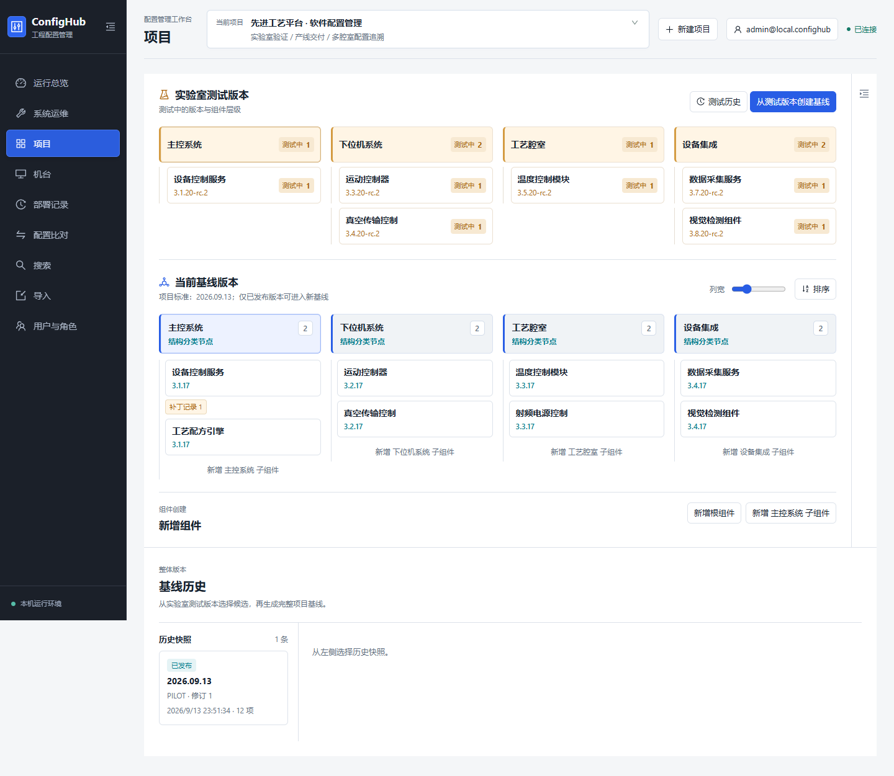
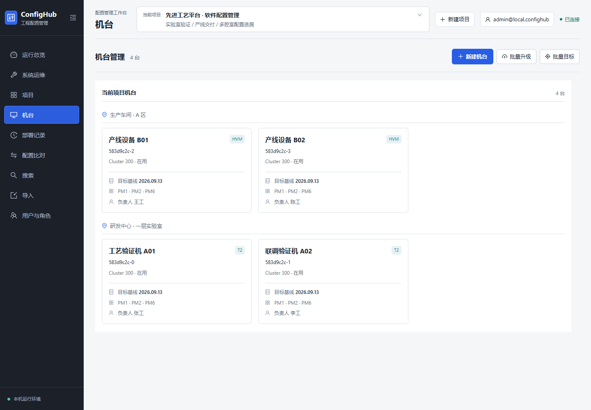
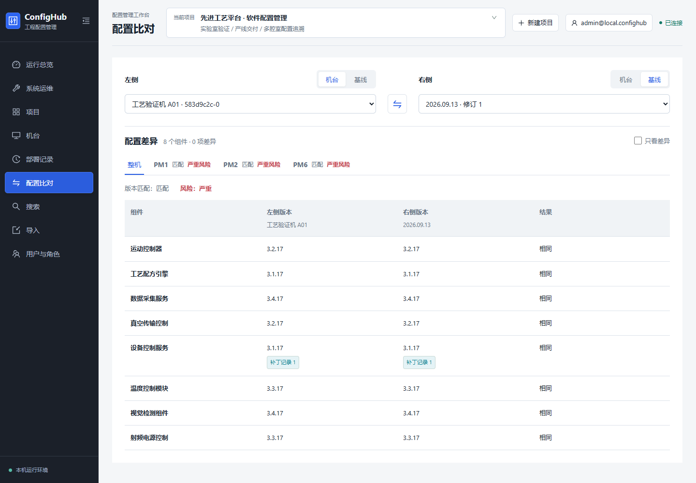
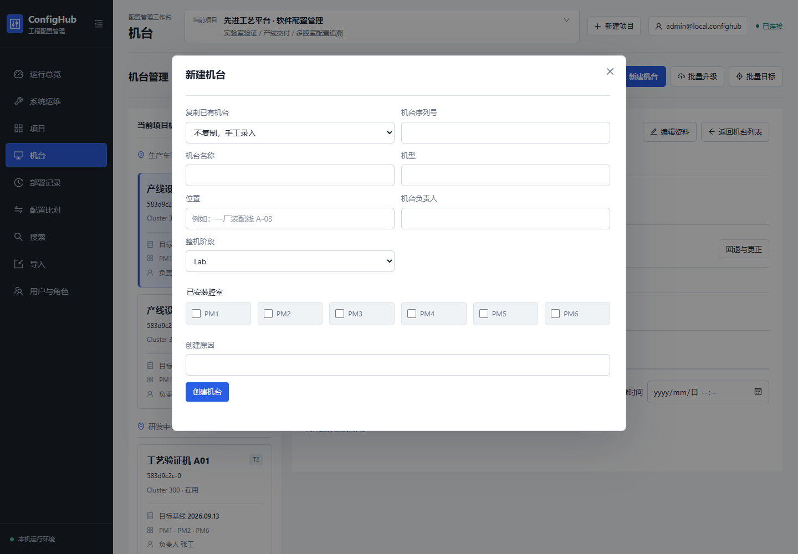

# UI 升级与验收

日期：2026-09-13。分支：`codex/futuristic-ui`。未合并主分支。

## 设计方向

以精密仪器工作台为方向：石墨导航、浅铂灰底色、白色操作区、细边界和克制的电蓝强调。保留中文主界面，不使用大面积深色、霓虹或装饰性背景影响读数。

- 蓝色表示选择和主要操作，青色区分版本读数；琥珀色标识实验室测试，红色独立表达严重风险。
- 树、快照和机台实际配置保持父子层级；组件名称和版本仍为两行。选中检查器按需展开，保留列宽、排序与拖拽。
- 统一按钮、表单、分段选择、弹窗与焦点状态。折叠导航仍有图标、可访问名称及悬停标题。
- 项目名称和简介集中在顶部，长名称可换行；用户列表先显示记录，新增与调权使用弹窗，支持姓名/用户名/中文角色筛选。
- 搜索结果显示所属项目，并利用已加载的当前项目组件信息区分同号版本；不额外请求其他项目的详情。
- 机台按位置分组，分层展示名称、阶段、标识、目标、PM 和负责人；匹配与风险标记独立。

## 实页复核

使用真实 Host/API/PostgreSQL 和独立验收项目，不用静态假页面代替运行结果。截图数据为验收构造数据，项目结束后归档。自动化截图必须等弹窗入场完成，避免把透明动画中间帧当作验收结果。

| 场景 | 检查内容 | 结果 |
| --- | --- | --- |
| 导航和项目栏 | 图标/文字可读、项目名称与简介间距、收起后仍可定位 | 通过 |
| 项目树和检查器 | 四根常规数据、六根长名称数据、两行节点、操作区不竖排 | 通过 |
| 基线历史 | 冻结快照与当前树采用相同父子结构、顺序和版本层级 | 通过 |
| 机台/PM | 位置分组、资料、实际配置、目标、阶段与腔室、历史 | 通过 |
| 比较 | 整机/PM、版本匹配与严重风险同时出现、只看差异 | 通过 |
| 弹窗和补丁 | 登录、新建项目/机台/用户、角色调整、补丁悬浮和关闭 | 通过 |
| 搜索/导入/部署/运维 | 原生输入一致、列表可扫描、复选框尺寸正常 | 通过 |
| 只读用户 | 查看与筛选保留，写入表单和管理员入口隐藏 | 通过 |
| 响应式 | 1440/1366/768/390，无页面横向溢出，窄屏重新排布 | 通过 |

复核中返修了窄检查器按钮竖排、项目栏被旧样式覆盖、图标混入按钮名称、旧焦点色、过大复选框、机台严重风险不醒目及用户列表过长问题。

这份记录代表开发侧的实际截图检查与自动化验收，不冒充真人试点评价。主观视觉偏好和真实业务大数据密度仍由分支预览复核，不直接替换主分支。

## 自动验证

- `future-ui-acceptance.cjs`：登录、9 个页面、35 张截图、用户创建和角色变更真实保存、Viewer、冻结数据和风险语义。
- 原有工作区、项目范围/上下文、版本登记、组件/基线简化、机台设备、PM 比较、配置/历史补丁、维护、版本删除、影响确认、启动/导入回归通过。
- Release 构建 0 warning / 0 error；真实 Migration 已最新，EF 无待迁移模型变更；前端构建通过，无大包警告。
- catalog、background-job、Windows operations preflight（13 个脚本）及 web compatibility 通过。
- 完整截图与结果保存在本地 `artifacts/future-ui/`，以下精选截图随分支提交。

## 预览

## 合并说明

本分支变更限于前端呈现、用户管理交互及相关测试/文档。沿用原 API、事务、权限、审计、幂等与模型；无新增 Migration，没有重写已发布快照或机台事实。PostgreSQL 17 与 Windows Production Integration Pending 的原验收边界不变。未经确认不合并 `main`。
