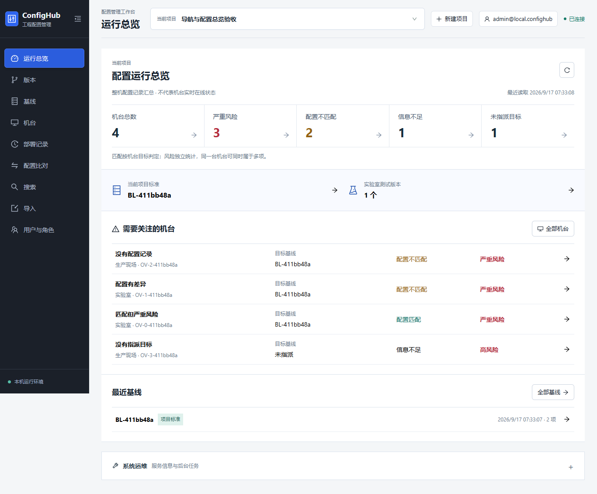
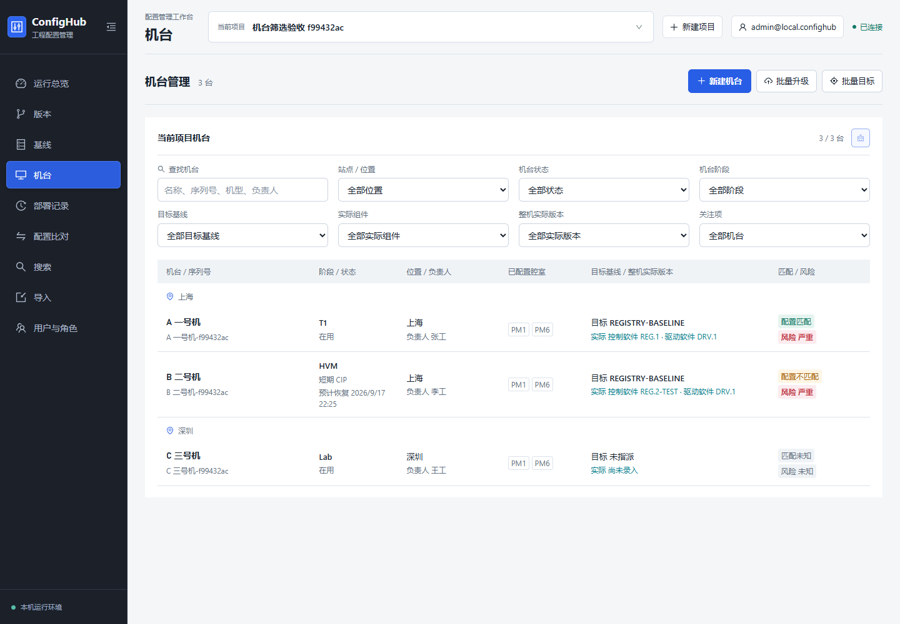
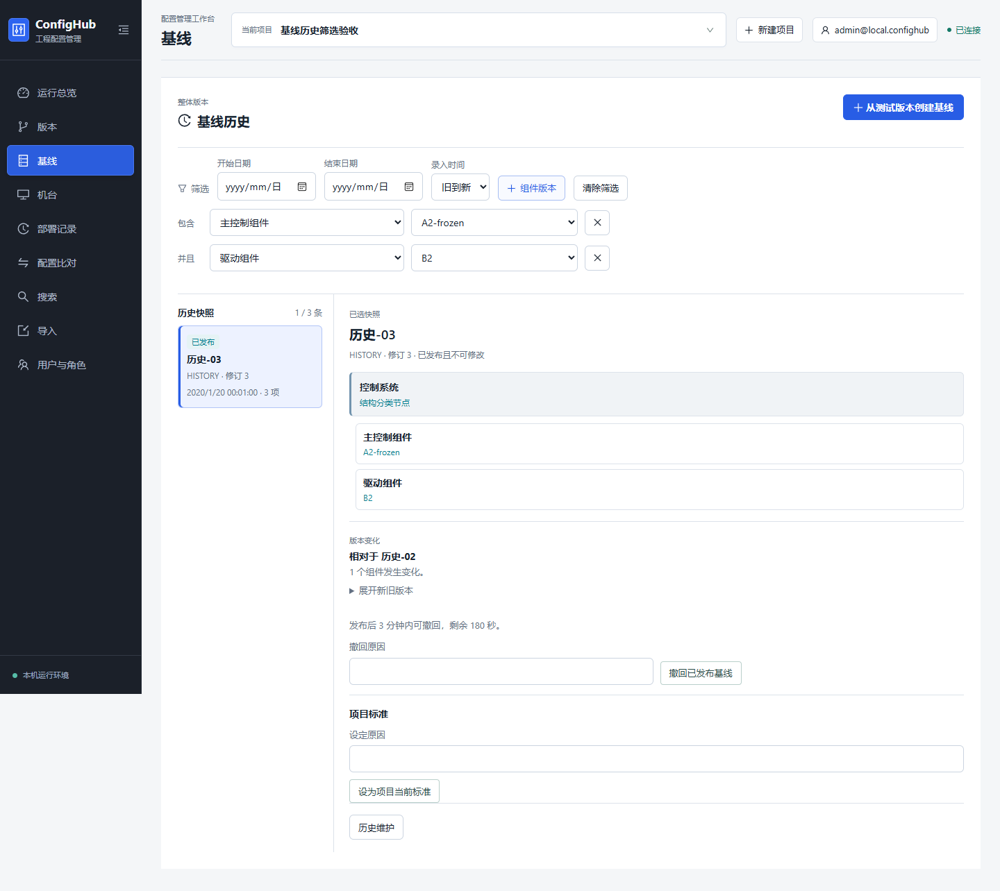

# 页面职责与筛选升级

开发日期：2026-09-16。验收完成：2026-09-17。分支：`main`。

## 总览的用途

原页面混合了服务身份、队列诊断和机台统计，普通用户难以判断应关注什么。现在以当前项目的整机配置记录为中心，回答三个问题：

- 哪些机台存在严重风险、配置差异、信息不足或未指派目标？点击计数或机台即可进入对应列表/详情。
- 当前项目采用哪个标准基线，还有多少实验室测试版本？两项均可进入对应页面。
- 最近形成了哪些已发布基线？按录入时间展示，点击查看冻结快照。

这不是机台在线或产能监控。匹配按机台目标判定，风险独立统计，数量可能重叠；PM 特例仍在机台详情单独比较。没有记录、请求失败都不会显示成“全部健康”。服务版本与全系统后台任务属于管理员诊断，收到总览的“系统运维”折叠栏目，展开后才读取队列。

## 页面分工

- 版本：组件树、实验室测试、当前标准版本树及单个版本/补丁管理。
- 基线：整体冻结快照、时间和组件版本筛选、历史比较、项目标准及既有受保护操作。
- 机台：一机一行，展示位置/负责人、状态/阶段、PM、目标基线、整机实际版本与独立匹配/风险；筛选始终限定顶部当前项目。

基线多组件条件是 AND，日期范围包含本地结束日。筛选依据冻结名称和版本，改名不会改写历史；比较对象始终是完整时间序列中的上一条，不会因筛选而跳过中间历史。项目标准标签不改变机台目标。

## 验收

- 新增三组实际 API/浏览器验收：机台列表与筛选；基线冻结索引/日期/多组件筛选；导航拆分与可点击的运行总览。
- 合计 21 组 UI/API 回归通过，包含版本登记/废弃/删除、补丁、基线发布和维护、权限、PM、配置比对、导入及旧入口迁移。
- 独立 Host 验证关闭超级维护后仍禁止新请求和幂等重放，正常登记可用；未修改用户当前维护开关。
- Release 构建 0 warning / 0 error，前端构建通过且无大包警告；真实 Migration 已最新，EF 无模型差异。
- catalog/background-job、Windows operations preflight（13 个脚本）与 web compatibility 通过。
- 桌面、平板、手机截图已逐项复核；返修了未继承新版风格的按钮与筛选控件命名。以下为自动创建并归档的验收项目，不是用户业务数据，也不代表真人试点验收结论。

## 截图

## 边界

本轮没有修改模型或新增 Migration，没有将项目标准与机台目标合并，也没有改写机台实际/历史事实。日期验收发现旧历史维护接口保存非 UTC 时间会失败，已在保存前转换为同一时间点的 UTC。现有超级维护的权限和开关不变。PostgreSQL 17 / Windows Production Integration Pending 仍明确保留。
